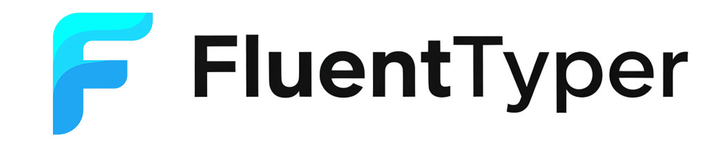

# FluentTyper

Type less, do more. FluentTyper brings smart autocomplete, spell checking, and text expansion to text inputs across the web.

[](https://github.com/bartekplus/FluentTyper/actions/workflows/test.yml)
[](LICENSE)
[](https://www.buymeacoffee.com/FluentTyper)

## Quick Links

- Install: [Chrome](https://chrome.google.com/webstore/detail/fluenttyper-autocomplete/mbjlobpodpimgbkmlmjiblnmfgajmebm), [Firefox](https://addons.mozilla.org/en-US/firefox/addon/fluenttyper/), [Edge](https://microsoftedge.microsoft.com/addons/detail/fluenttyper-autocomplete/ljenfpihmhkddgmjoipinkhflinoofcn)
- Report a bug: [GitHub issue form](https://github.com/bartekplus/FluentTyper/issues/new/choose)
- Request a feature: [Feature request form](https://github.com/bartekplus/FluentTyper/issues/new?template=feature_request.yml)
- Contributing: [CONTRIBUTING.md](CONTRIBUTING.md)
- Security policy: [SECURITY.md](SECURITY.md)
- Sponsor development: [Buy Me a Coffee](https://www.buymeacoffee.com/FluentTyper)

## Why FluentTyper

FluentTyper helps you write faster and with fewer mistakes:

- Predictive autocomplete while typing
- Local prediction with libPresage (WebLLM path is currently dev/debug-only)
- Spelling suggestions
- Text expansion snippets for repeated phrases
- Keyboard-first suggestion selection with arrow keys and `Tab`

Example: type `callMe` and expand it to `Call me back once you're free`.

## Supported Languages

- English
- Spanish
- French
- Croatian
- Greek
- Swedish
- Polish
- German
- Brazilian Portuguese

## Installation

- [Chrome](https://chrome.google.com/webstore/detail/fluenttyper-autocomplete/mbjlobpodpimgbkmlmjiblnmfgajmebm)
- [Firefox](https://addons.mozilla.org/en-US/firefox/addon/fluenttyper/)
- [Edge](https://microsoftedge.microsoft.com/addons/detail/fluenttyper-autocomplete/ljenfpihmhkddgmjoipinkhflinoofcn)

## Quick Start

1. Install FluentTyper from your browser store.
2. Click any regular text input field on a website.
3. Start typing to see suggestions.
4. Use arrow keys to choose a suggestion.
5. Press `Tab` to accept, or `Esc` to dismiss.

## Site Profiles and Precedence

FluentTyper applies configuration in this order:

1. Global enable switch (`Enable Extension`) must be on.
2. Domain allow/block mode decides if FluentTyper runs on the current site.
3. If a site profile exists for the current domain, it overrides config values:
   - `language`: always overridden by the profile value.
   - `inline_suggestion`: overridden only when set in the profile; otherwise inherited from global.
   - `numSuggestions`: overridden only when set in the profile; otherwise inherited from global.

Site profiles never bypass domain enable/disable logic. If a domain is blocked by allow/block mode, FluentTyper remains disabled there even if a profile exists.

## Compatibility

FluentTyper works on most websites. Some rich text editors (for example Google Docs) can be partially or fully incompatible.

If you hit an unsupported site, please open a bug report so compatibility can be improved.

## AI Predictor (WebLLM, Dev/Debug Only)

WebLLM is currently available only in development/debug builds.

- Production store builds (Chrome, Firefox, Edge) currently run libPresage-only.
- The AI predictor toggle is not exposed to end users in production builds.
- In dev/debug builds, WebLLM can run in parallel with Presage and falls back automatically when unavailable.
- In dev/debug builds, first AI use downloads model artifacts once; subsequent runs use browser cache.

## Privacy

FluentTyper is privacy-first:

- No upload of your typed content
- Works offline
- Predictions are generated locally on your computer
- In dev/debug builds, when AI predictor is enabled, only model artifacts are downloaded; typed content stays local

## Bug Reporting

Please report bugs through GitHub Issues using the bug template:

- Issue chooser: [github.com/bartekplus/FluentTyper/issues/new/choose](https://github.com/bartekplus/FluentTyper/issues/new/choose)
- Direct bug report form: [bug_report.yml](https://github.com/bartekplus/FluentTyper/issues/new?template=bug_report.yml)

To speed up triage, include:

- Steps to reproduce
- Expected behavior
- Actual behavior
- Browser and FluentTyper version
- Screenshots or recordings when possible

## Feature Requests

Use the feature request form to propose improvements:

- Issue chooser: [github.com/bartekplus/FluentTyper/issues/new/choose](https://github.com/bartekplus/FluentTyper/issues/new/choose)
- Direct feature form: [feature_request.yml](https://github.com/bartekplus/FluentTyper/issues/new?template=feature_request.yml)

Good feature requests include:

- The problem you want to solve
- The proposed solution
- Alternatives you considered
- Browser context and examples or mockups

## Security

If you discovered a security vulnerability, follow [SECURITY.md](SECURITY.md) and avoid opening a public issue.

## Contributing

Development and contribution guidelines are in [CONTRIBUTING.md](CONTRIBUTING.md).

## Development Setup (Bun)

FluentTyper uses [Bun](https://bun.sh/) as the primary package manager and script runner.

Prerequisites:

- Bun `1.3.10` (pinned in `packageManager`)
- Node.js `24` (runtime compatibility target used in CI)

Install and run common tasks:

```bash
bun install
bun run build
bun run check
bun run test
```

Migration note: `bun.lock` is the source of truth for reproducible installs. npm/pnpm are no longer required for normal development workflows.

## Sponsorship and Support

If FluentTyper saves you time, you can support maintenance and future development:

[](https://www.buymeacoffee.com/FluentTyper)
