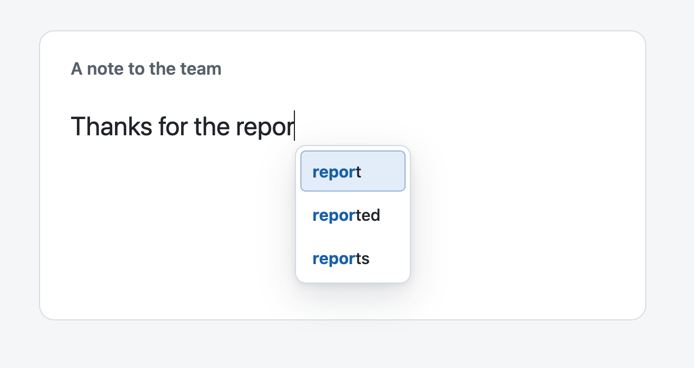
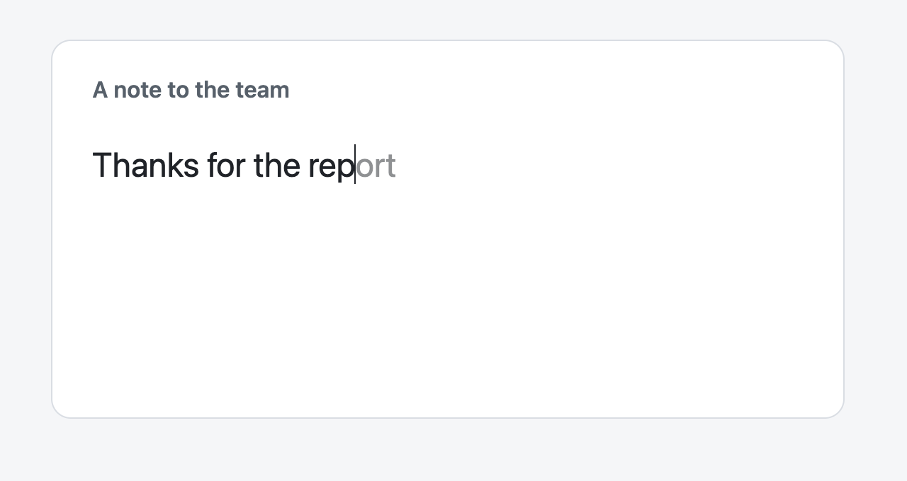
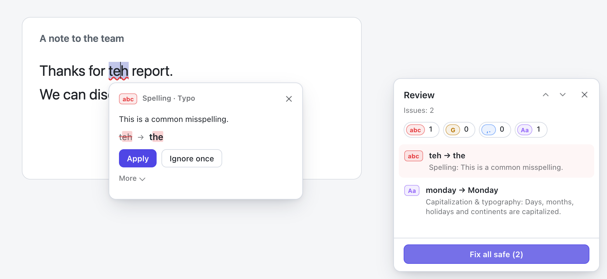

  

<h1 align="center">FluentTyper</h1>

<strong>Less typing. More you.</strong>

  Complete words. Reuse your phrases. Check your draft. 
  Right where you write, with your text on your device.

  <a href="https://chromewebstore.google.com/detail/fluenttyper-autocomplete/mbjlobpodpimgbkmlmjiblnmfgajmebm"><strong>Get for Chrome</strong></a>
  ·
  <a href="https://addons.mozilla.org/en-US/firefox/addon/fluenttyper/"><strong>Get for Firefox</strong></a>
  ·
  <a href="https://microsoftedge.microsoft.com/addons/detail/fluenttyper-autocomplete/ljenfpihmhkddgmjoipinkhflinoofcn"><strong>Get for Edge</strong></a>

Free · Open source · Works offline

## A little help. Right where you type.

Choose a list of words, or see a completion beside your cursor. Press **Tab** to accept a suggestion. Keep typing to continue your thought.

### Choose from a list

Popup mode shows alternatives beside your cursor. Use the arrow keys to choose a word.

### Stay in the line

Inline mode shows one suggested ending beside the letters you typed. Press **Tab** when it is the word you want.

[Choose your typing mode](docs/typing.md) · [Set preferences for each site](docs/site-settings.md)

## Your usual reply. In a few letters.

Save a shortcut for a reply, an address, or a phrase you use often.

**`callMe` → “Call me back once you're free”**

Type your shortcut, then accept the expansion. [Create your first shortcut](docs/typing.md#reuse-a-phrase).

## One last look before you send.

Review finds spelling, grammar, and punctuation issues in your draft. See each proposed change before you apply it.
Opening Review leaves your words unchanged.

Choose a correction, ignore it, or use **Fix all safe** for eligible corrections.
[Learn how Review works](docs/review-mode.md).

_Screenshots show the real extension on a local page with example text._

## Your words stay yours.

Suggestions and standard Review work on your device, including offline. FluentTyper does not upload your typed content.
No AI model download is needed for these features.

You choose where FluentTyper runs. [Read about privacy](SECURITY.md#your-text-and-privacy).

## Start with your next sentence.

1. Install FluentTyper from your browser store above.
2. Select a text field on a supported website.
3. Start typing.

Press **Tab** to accept a suggestion or **Esc** to dismiss it.
To check a draft, select **Review text** in the extension popup or press **Alt+Shift+R**.

English · Spanish · French · Croatian · Greek · Swedish · Polish · German · Brazilian Portuguese · Arabic

[Choose your language and see available checks](docs/review-language-matrix.md).

## Make it work for you.

| I want to…                    | Start here                                                             |
| ----------------------------- | ---------------------------------------------------------------------- |
| Change how suggestions appear | [Popup and inline modes](docs/typing.md)                               |
| Adjust one website            | [Site settings](docs/site-settings.md)                                 |
| Check Gutenberg support       | [Implementation status and test coverage](docs/gutenberg-support.md)   |
| Write in Google Docs          | [Google Docs help and browser limits](docs/google-docs-integration.md) |
| Format numbers and units      | [Measurement spacing](docs/measurement-formatting.md)                  |
| Understand optional Local AI  | [Availability and privacy](docs/local-ai-review.md)                    |

Some editors support fewer features or cannot use FluentTyper. Review checks also vary by language.
Local AI is optional and is not in Firefox builds. Standard Review works without it.

## Help make it better.

[Report a bug](https://github.com/bartekplus/FluentTyper/issues/new?template=bug_report.yml) ·
[Suggest a feature](https://github.com/bartekplus/FluentTyper/issues/new?template=feature_request.yml) ·
[Support development](https://www.buymeacoffee.com/FluentTyper)

For security concerns, use the [private reporting process](SECURITY.md#report-a-security-issue).

**For developers:** [Contribute](CONTRIBUTING.md) · [Build](docs/agents/commands.md) · [Architecture](docs/agents/architecture.md) · [Test](docs/agents/testing.md) · [Measure performance](docs/extension-performance.md)

---

[MIT license](LICENSE) · Bartosz Tomczyk
