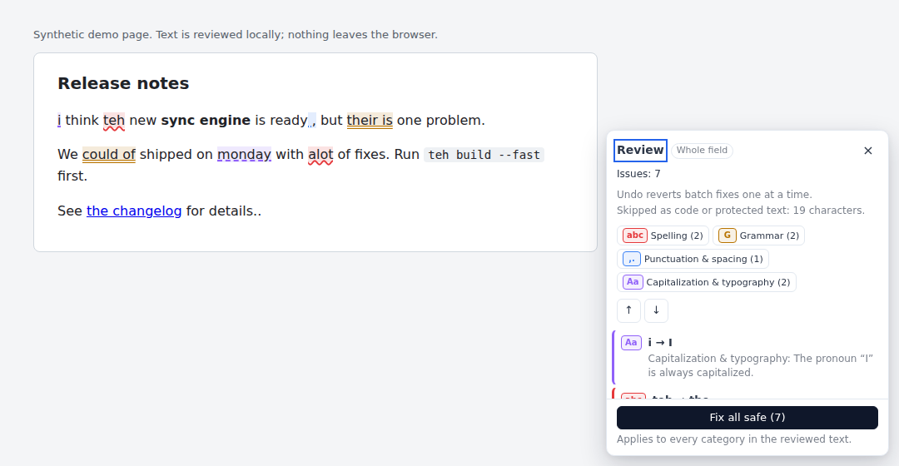
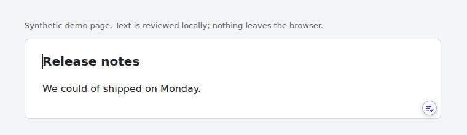
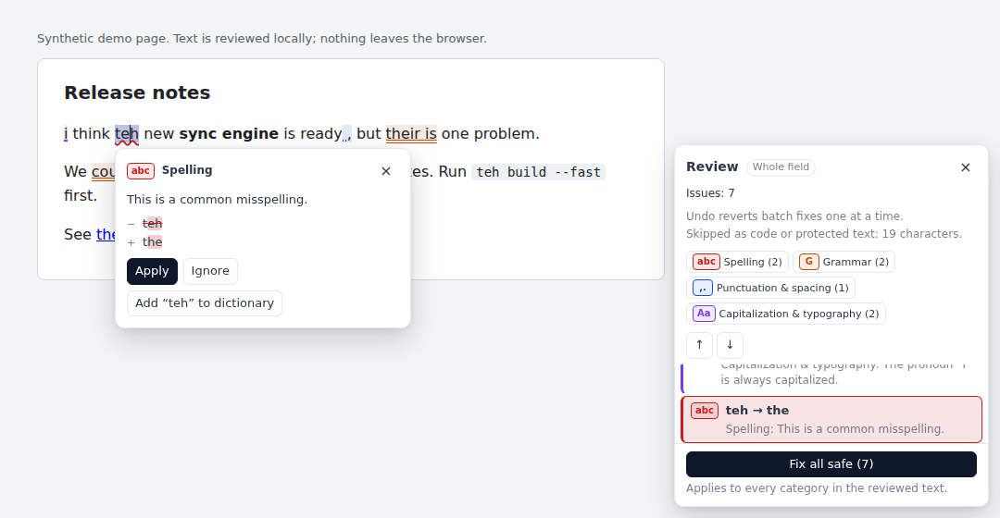
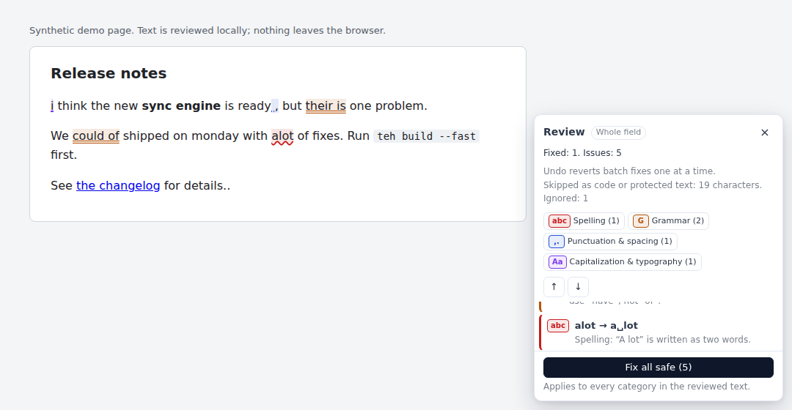
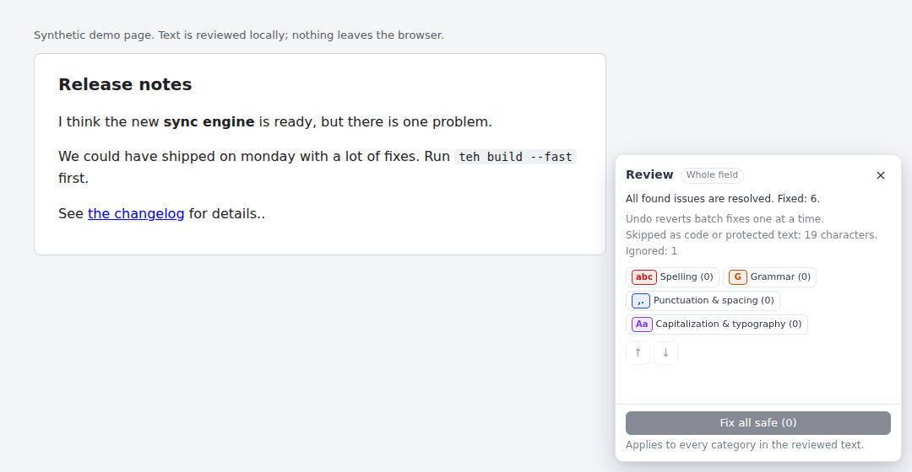
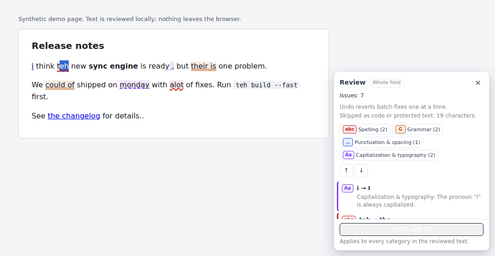
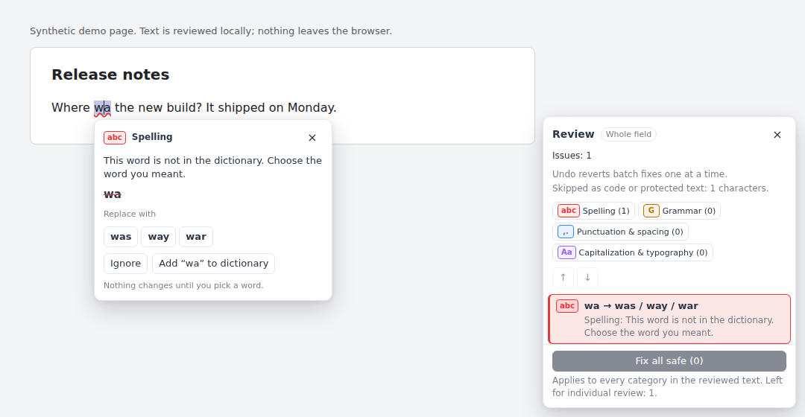

# Review Text

"Review text" proofreads text you have already written, in the editor you are
using, with the same local grammar rules that can correct you while typing. It runs
entirely in the page: no text leaves the browser, nothing is logged or stored,
and it needs no extra permissions.



## Using it

Put the cursor in a text field, then either:

- press **Alt+Shift+R** (the suggested shortcut; change it in the browser's
  extension shortcut settings),
- click the **Review** button in the corner of the text box you are writing in, or
- open the FluentTyper popup and choose **Review text**.

With several text boxes on a page, each of these reviews only the one you are
in (the one with the cursor); the others are never read or changed.
In Google Docs, use the shortcut or the popup; there is no Review button there.



The **Review button** is one small button, drawn in FluentTyper's own layer,
so the page's layout and the field's padding are untouched:

- It appears only on the focused **multi-line** field (text areas and rich
  editors, not search boxes or other single-line inputs), once the field
  holds some text, and only where review can run (not in sensitive, locked,
  code or very small fields, not in Google Docs, not in code mode).
- It hides while you type, comes back when you pause, and steps aside while
  that field's review is open. Clicking it keeps your cursor and selection, so
  a selection is reviewed on its own, exactly as with the shortcut.
- One icon per field: where FluentTyper waits for the "enable here" icon
  (a field with the browser's own autocomplete), that icon shows instead.
- It is not a tab stop; keyboard users have the shortcut. Turn it off under
  **Settings → Grammar → Review text**.

What gets reviewed:

- A selection wholly inside one editor: **that selection** ("Selection" in the panel).
- Otherwise: **the whole focused editor** ("Whole field"). Review never scans the page.
- A selection that crosses editors, a password, payment, security-code or
  one-time-code field (by type, `autocomplete` token, name or masking), and
  hidden, unrendered, read-only or disabled fields are refused with an
  explanation.
- In a modal dialog the review opens inside the dialog, so it stays usable.

Starting a review changes nothing: not the text, formatting, selection,
settings or learning data. While a review is open, typing-time corrections
and suggestions pause for that editor, and resume when it closes.

### Highlights and the card

| Category                      | Color  | Line             | Badge |
| ----------------------------- | ------ | ---------------- | ----- |
| Spelling                      | red    | wavy underline   | `abc` |
| Grammar                       | amber  | double underline | `G`   |
| Punctuation and spacing       | blue   | dotted underline | `,.`  |
| Capitalization and typography | purple | dashed underline | `Aa`  |

Color is never the only signal: each category also has its own line style and
badge, and the card and list name the category in words. The underline colors
keep at least 3:1 contrast on light and dark pages alike, whatever the OS theme. In forced-colors
(high-contrast) mode the highlights use system colors with the same line styles.

Click a highlight, or choose a finding in the list, to open its card:
category, explanation, the change (original and replacement), any
alternatives, and **Apply**, **Ignore** and, for single-word spelling findings,
**Add "word" to dictionary** (the existing FluentTyper dictionary).



The panel shows the scope, the count, per-category filters, previous and next,
close, and **Fix all safe (N)**. Fix all applies only the findings that are
visible under the current filters, whose rule is batch-approved, and whose fix
is proven not to conflict with another fix. Everything else stays for review
one by one. The line under the button says what Fix all covers.

| Ignore one finding                               | Fix all safe                                 | Native undo                            |
| ------------------------------------------------ | -------------------------------------------- | -------------------------------------- |
|  |  |  |

Note that `teh` inside the code span, the bold text and the link are untouched.

### Keyboard

- The panel takes focus when a review starts (except in Google Docs, which
  needs its own focus). **Tab** moves through the panel. Arrow keys move
  through the list. **Enter** or **Space** opens the card for a finding.
- **Escape** closes the card first, then the review. Focus returns to the editor.
- Pressing the shortcut again while the panel has focus keeps the review.
- In the editor, review never captures **Tab** or **Enter**.

### States

The panel names every state:

- **Loading:** "Checking…"
- **Results:** "Issues: N"
- **Nothing found:** "No issues found by the review checks"
- **Code mode:** "No review checks run in code mode."
- **All resolved:** "All found issues are resolved. Fixed: N."
- **Ignored:** "Ignored: N", and "All remaining issues are ignored." once nothing else is left
- **Paused:** while an IME composes ("Paused while you compose")
- **Stale selection:** after an edit at the selection's edge
- **Unsupported, review-only or sensitive editor:** says which
- **Partial coverage:** protected text skipped, the size limit, rules
  skipped for the language, or (Google Docs, past 50,000 characters) text outside
  the window around the cursor, with the scope shown as "Part of the document"
- **Fix outcomes:** a fix the editor refused, or one it only partly applied
- **Error:** "Review failed. Close it and try again." (a scan that fails never
  leaves "Checking…" on screen)
- **Planning:** "Fix all safe (…)" while dependent fixes in a very large,
  error-dense text are still being proven; Fix all waits for the proof

## Rules and categories

Review reuses the typing-time rules' own patterns, word lists and helpers.
Each catalog rule is classified in
[`reviewCatalog.ts`](../src/core/domain/grammar/review/reviewCatalog.ts), and
its `Record` type makes an unclassified new rule a compile error. Review runs
every supported rule, whether or not it is switched on for typing (even after
"Disable all"): review never changes text until you apply a fix, so the
typing-time switches, which decide what is corrected automatically as you
type, do not gate it. Typing-time corrections still follow your settings
exactly. Code mode is the exception: it keeps only code-safe rules, none of
which review supports, so a review there finds nothing and the panel says so.
English rules are skipped for other languages, and the panel says so.

Supported (**Typing** is the rule's default for typing; review runs it either way):

| Rule                                   | Language | Typing | Category    | Fix all                                                                                           |
| -------------------------------------- | -------- | ------ | ----------- | ------------------------------------------------------------------------------------------------- |
| `capitalizeSentenceStart`              | all      | on     | typography  | yes (after a quote or bracket closing a period: individual only)                                  |
| `capitalizeAfterLineBreak`             | all      | on     | typography  | individual only: line starts in poems, lists and hard-wrapped text are often lowercase on purpose |
| `englishPronounICapitalization`        | English  | on     | typography  | yes                                                                                               |
| `englishContractionNormalization`      | English  | on     | spelling    | yes                                                                                               |
| `englishTypoWhitelistCorrection`       | English  | on     | spelling    | yes                                                                                               |
| `englishModalOfCorrection`             | English  | on     | grammar     | yes                                                                                               |
| `englishYourWelcomeCorrection`         | English  | on     | grammar     | yes                                                                                               |
| `englishTheirThereBeVerb`              | English  | on     | grammar     | yes                                                                                               |
| `englishAlotCorrection`                | English  | on     | spelling    | yes                                                                                               |
| `englishPronounVerbWhitelistAgreement` | English  | on     | grammar     | yes ("you was" away from a clause start: individual only)                                         |
| `englishArticleAnCorrection`           | English  | off    | grammar     | individual only: word-list heuristic; a letter or identifier can look like an article             |
| `englishOrdinalSuffix`                 | English  | off    | typography  | yes                                                                                               |
| `englishProperNounCapitalization`      | English  | on     | typography  | yes (months that need a date as evidence: individual only)                                        |
| `measurementUnitFormatting`            | all      | on     | punctuation | individual only: units in technical prose are meaning-sensitive                                   |
| `currencySpacing`                      | all      | on     | punctuation | yes                                                                                               |
| `commaPeriodSpacing`                   | all      | on     | punctuation | yes                                                                                               |
| `collapseRepeatedSpaces`               | all      | on     | punctuation | yes (alignment gaps and Markdown table padding are left alone)                                    |
| `duplicatePunctuationCollapse`         | all      | off    | punctuation | yes                                                                                               |

Some text is left alone because it only looks like an error: "you" as an
object ("Everything I told you was a lie"), a lowercase dialogue tag after a
quoted "!" or "?" ("“Stop!” she said"), a mark named between spaces ("press .
to repeat"), and a word joined to a hyphen after it ("--dont-ask", "dont-care").
After a hyphen ("x-teh"), where typing still corrects it, the fix is individual only.

Unlike typing, review sees the words after a word as well as before it, so it
decides some cases typing has to leave as typed. These are always individual
fixes (never in Fix all), because the deciding words are only evidence:

- **Months:** "in may.", "until march,", "last may,", "the end of august",
  "on 5 may." and "april or may" are the month. "It may rain", "they march",
  "an august institution" and "the last march" stay as written.
- **Contractions:** "cant", "wont" and "ill" before a bare verb: "I cant go",
  "It wont work", "ill be there". "The cant of the roof", "as is his wont" and
  "fell ill" stay.
- **"i" ending a sentence:** "taller than i." (typing cannot rule out "i.e.").
  A roman-numeral list marker ("i. First") or part ("Part i.") stays.

Excluded (typing conveniences, not errors in finished text):

| Rule                                 | Why                                                                        |
| ------------------------------------ | -------------------------------------------------------------------------- |
| `doubleSpaceToPeriod`                | Typing shortcut: existing double spaces are not sentence ends.             |
| `technicalTokenCompaction`           | Ambiguous in finished text: "Chapter 3: 5 tips" is not a clock time.       |
| `mathOperatorSpacing`                | Typing-time style; existing operators are often code or notation.          |
| `slashContextSpacing`                | Spacing around an existing slash is style, not an error.                   |
| `openingBracketSpacing`              | Only spaces code-like `){`; not prose proofreading.                        |
| `closingBracketSpacing`              | Bracket spacing in finished text is often notation, Markdown or intervals. |
| `trimSpaceBeforeLineBreak`           | Invisible, and two trailing spaces are a Markdown line break.              |
| `ellipsisShortcut`, `emdashShortcut` | Typing shortcuts, not errors.                                              |
| `smartQuoteNormalization`            | Straight quotes in finished text may be code or deliberate.                |
| `frenchPunctuationSpacing`           | Typing-time convention; invisible no-break space changes.                  |
| `autoBracketClose`                   | Review never inserts closing brackets.                                     |

### Unknown words

Besides the rules, review checks each prose word against the language's
dictionary: the same local Presage engine (Hunspell and Aspell predictors) that
offers spelling corrections while you type. A word the dictionary does not know
("Where **wa** it?") is listed with the closest words Presage suggests for it,
ranked for the words before it: `wa → was / way / war`.



- **Nothing is preselected and nothing is fixed automatically.** The card shows
  the word and one button per suggestion; one click (or Enter) on a suggestion
  replaces the word with it, as one native undo step. Arrow keys move between
  suggestions; **Ignore** and **Add to dictionary** work as for any finding.
- **Never in Fix all.** These findings count as left for individual review.
- **Only close suggestions.** A suggestion must be one edit away for a word of up
  to five letters, two for a longer one; completions ("wa" → "water") are
  dropped. A word with no close suggestion is not listed at all, and neither is
  a compound the dictionary can split into two words ("changelog", "webhook").
- **Left out:** names (a capitalized word inside a sentence), acronyms and
  mixed case ("NASA", "iPhone"), words glued to digits, symbols or hyphens,
  anything touching code or protected text, words another rule already flags,
  and the user's dictionary.
- **When it runs:** after the rule results are shown ("Checking spelling…"
  while it runs), a few words at a time, with answers remembered for rechecks.
  Each different word is looked up once, and each request to the background
  engine stops after about 40 ms, so typing suggestions in other tabs never wait
  long. One pass checks at most 2,000 different words, and stops early once 100
  are unknown (text in another language, say); the panel then says spelling was
  checked only in the first part, and a recheck continues from there.
  It does not run in code mode, and it needs a Presage dictionary for the
  language; without one the panel says spelling suggestions are unavailable.
- **Local:** the words go from the page's content script to the extension's own
  background engine and back; nothing leaves the browser, nothing is stored or
  logged, and the engine does not learn from them.

A finding whose fix depends on context another fix changes is batched only
when re-detection proves both still hold together. Otherwise both are left
for individual review. A fix that would create a new finding is never chained:
the new finding appears on the recheck.

## What is protected

Review never flags or edits:

- **Code:** `code`, `pre`, `kbd` and `samp` elements; Quill code blocks; code
  editors (CodeMirror, Monaco, Ace…); code mode (none of the supported rules
  is code-safe); and Markdown code: backtick spans, ` ``` ` and `~~~`
  fences, and indented blocks.
- **Technical tokens:** URLs, e-mail addresses, paths, @mentions, #hashtags,
  dotted names, and any token over 100 characters (hashes, base64, minified code).
- **Structure:** images, embeds and `contenteditable=false` islands (read as
  one object character); block and line breaks; collapsed whitespace runs; and
  zero-width cursor guards.

Protected text is masked for the detectors, so no pattern can join words
across it. The panel reports how much text was skipped.

Formatting-only changes, such as text turned into code, change the snapshot
signature and invalidate pending fixes.

## Editor support

| Editor                                                                                 | Highlights                                                              | Apply one                               | Fix all | Undo                                     |
| -------------------------------------------------------------------------------------- | ----------------------------------------------------------------------- | --------------------------------------- | ------- | ---------------------------------------- |
| `<textarea>`, text `<input>`                                                           | overlay measured through a hidden mirror in FluentTyper's shadow root   | yes                                     | yes     | one native undo step for the whole batch |
| `contenteditable`                                                                      | CSS Custom Highlights (overlay fallback, e.g. inside shadow DOM)        | yes                                     | yes     | one native undo step per fix             |
| Quill                                                                                  | CSS Custom Highlights                                                   | yes                                     | yes     | Quill history (a batch is one step)      |
| ProseMirror, Lexical, Slate, Draft.js, CKEditor 4/5, Trix, TinyMCE, Froala, Summernote | yes                                                                     | no: review-only, the panel explains     | no      | —                                        |
| Google Docs (existing bridge)                                                          | overlay over the text Docs shows; list only where Docs has not drawn it | yes: one verified replacement at a time | no      | Docs history                             |
| Code editors, sensitive and ineligible fields                                          | refused with an explanation                                             | —                                       | —       | —                                        |

Highlights never change the page's editor DOM. CSS highlights are registered
under FluentTyper's own names (`fluenttyper-review-*`); the page's and other
extensions' highlights are never touched. Everything is removed on close, on
navigation or when FluentTyper is disabled. If the editor leaves the page, the
panel says it is no longer available and nothing stays painted; a scripted
change to a text field is noticed within a second.

### Writes

Before every write, review re-reads the editor and checks all of these:

- the target is the same element and still eligible;
- the text matches the snapshot the finding came from;
- the structure signature is unchanged;
- the scope still holds;
- the edit's original characters are still there;
- no IME composition is active.

Findings are located by offsets into that snapshot, never by searching for the text.

Writes go through the browser's native editing command, so native undo works.
A text field that refuses that command is reported as refused rather than
written another way that undo would not restore, and so is a fix that would
make it longer than its `maxlength` (the browser would cut it). Focusing the editor can run
page code, so the checks above are repeated after focus moves and before the
write. The caret and selection keep their place between fixes.
After writing, review reads the editor back and reports anything that doesn't
match: a refusal, a partial write, or a result it could not verify. It never
retries blindly, and always rechecks afterwards. In a contenteditable, each edit
is verified in its own block, then the whole editor is read once at the end.
Long batches pause every 50 ms to keep the page responsive, and stop if the
text, focus or composition changed during a pause.

## Architecture

```
Domain       src/core/domain/grammar/review/
             types.ts            diagnostic contract (UTF-16, end-exclusive, one snapshot)
             reviewCatalog.ts    per-rule review metadata and coverage map
             reviewDetectors.ts  detectors built on the typing rules' exports
             reviewDiagnostics.ts prepare / chunk / scan / finalize; proof step
             reviewSpelling.ts   unknown words: what to look up, which suggestions to offer
             bulkPlanner.ts      Fix-all planning: conflicts deferred, proofs in rounds
             textRanges.ts       edits, diffs, remapping, grapheme boundaries
             reviewMessages.ts   explanations and UI strings (9 languages)
Application  src/core/application/review/ReviewSession.ts
             lifecycle, debounced rechecks, ignores, apply / Fix all through a port
Adapters     src/adapters/chrome/content-script/review/
             ReviewTargets.ts, ContentEditableTextMap.ts, GoogleDocsReviewTarget.ts
             ReviewController.ts (listeners, painting, focus)
UI           ReviewUi.ts, reviewStyles.ts (shadow DOM, top-layer popover)
Background   CommandRouter (shortcut), MessageRouter (add to dictionary, dictionary
             lookups through PresageEngine.lookupWords)
```

Nothing is created, observed or scanned until the first review. The review code
does ship in the content script, which grows by about 124 KB minified (43 KB
gzip) and is parsed in every frame; loading it as a separate chunk on first use
would need a `web_accessible_resources` manifest entry, left for a maintainer to
decide.

Limits: 50,000 characters per review (a larger scope is cut, and the panel
says so), scanned in chunks of about 4,000 characters that yield to the page.
Rechecks after edits are debounced by 400 ms and cancel stale work.

## Performance

These are measurements, not a budget. Environment: 4 vCPU Xeon (2.8 GHz),
headless Chrome for Testing 154 and Firefox 156 via Puppeteer, Bun 1.3.11.
The documents are deliberately dense: about one finding per 30 characters.

| Document                   | Findings | Chrome: results | Chrome: Fix all | Firefox: results | Firefox: Fix all |
| -------------------------- | -------- | --------------- | --------------- | ---------------- | ---------------- |
| textarea, 300 chars        | 12       | 40–60 ms        | 10–25 ms        | 130–150 ms       | 15–25 ms         |
| textarea, 10k              | 324      | 155–215 ms      | 75–95 ms        | 160–190 ms       | 40 ms            |
| textarea, 50k              | 1,616    | 410–575 ms      | 430–450 ms      | 490–500 ms       | 230–250 ms       |
| contenteditable, 434 chars | 14       | 35–40 ms        | 20–35 ms        | 95–105 ms        | 30–60 ms         |
| contenteditable, 10k       | 329      | 95–120 ms       | 245–295 ms      | 120–150 ms       | 1.1–1.6 s        |
| contenteditable, 50k       | 1,610    | 340–400 ms      | 1.9–2.3 s       | 315–345 ms       | 13.7 s           |

Detection alone (Bun, best of 5): 300 characters in 2 ms, 10k in 20–40 ms
and 50k in 95–150 ms. Planning Fix all for 1,352 findings takes 4 ms. No
single scan chunk takes longer than about 80 ms, even on adversarial input
(e.g. 50k of `2th`, `may 15` or `i dont`).

Known costs:

- The first paint of a 50k textarea includes one layout of the mirror
  (about 150 ms in Chrome).
- Firefox's native contenteditable editing costs about 5 ms per edit at 50k,
  so a very large contenteditable batch takes seconds. It pauses every 50 ms,
  so the page stays responsive.

## Limitations

- Findings are limited to the catalog rules above and the dictionary check for
  unknown words. Review is not a general grammar checker, and most rules are
  English-only.
- The dictionary check finds words the dictionary lacks, not real words in the
  wrong place ("form" for "from"). It follows the language setting: under
  `en_US`, British spellings are unknown words, and a name that opens a
  sentence is listed (with "Add to dictionary" to accept it).
- The review UI language follows the browser language (English, French,
  Croatian, Spanish, Greek, Swedish, German, Polish, Portuguese).
- Google Docs: findings are highlighted where Docs shows their text. Docs
  paints text on a canvas, and for an extension it allows (FluentTyper registers
  as one, as it does for autocomplete) it lays an invisible labelled box over
  each run of text; review places those runs in the document's text and
  measures each finding inside its run. Docs draws only the pages near where
  you are, so a finding elsewhere is in the list until you scroll to it; if
  Docs shows no runs at all, the panel says findings are listed only. No Fix
  all (one verified replacement at a time).
- Google Docs: a document of up to 50,000 characters is reviewed whole, even
  with all of it selected. In a longer one, 50,000 characters around the
  cursor are reviewed, starting at a sentence and ending at a whole word; the
  panel reports how much was not checked. Typing in the document rechecks, but
  changes Docs makes without input in its editor (a collaborator, a menu
  command) are noticed only at the next keystroke or write.
- Model-backed editors are review-only: writing behind their document model is not safe.
- Contenteditable undo is one step per fix; textarea and Quill undo a batch in one step.
  In Firefox, a fix that replaces all of a formatted word's text (a word that is
  its own bold, italic or link) takes two steps, so the space beside it is kept.
- Textarea highlights can be misplaced under an ancestor with CSS `zoom`.
- Chrome may turn a space next to an edit into a no-break space. Review
  accepts only that change next to the edit; any other difference, or text the
  browser put outside the link or formatting it came from, is reported.
- An ignore belongs to one occurrence and is dropped when an edit (including
  an undo) spans the ignored text.
- Chains of more than 8 mutually dependent fixes are left for individual review.
- A lowercase "i" before "is", or named by the word before it ("the variable
  i", "the index i"), and "i has" after words like "if" or "while", is left
  alone: it is usually a variable.
- A sentence that ends right after a contraction ("I don't. the end") is not
  seen as ended: the shared sentence rule reads "t." as an initial.
- "Add to dictionary" accepts one word (letters with inner apostrophes or
  hyphens) and only from a real click.

## Testing

```
bun run test                                  # unit: domain, session, adapters (jsdom), routing
bun run test:e2e / test:e2e:full              # Chrome; add -- --platform=firefox for Firefox
bun run test:e2e:docs                         # Google Docs fixture
bun run check:e2e:coverage                    # review_* behaviors in tests/e2e/coverage-matrix.json
E2E_EXTENSION_PATH=$PWD/build bun scripts/review-demo.ts   # demo and screenshots
```
