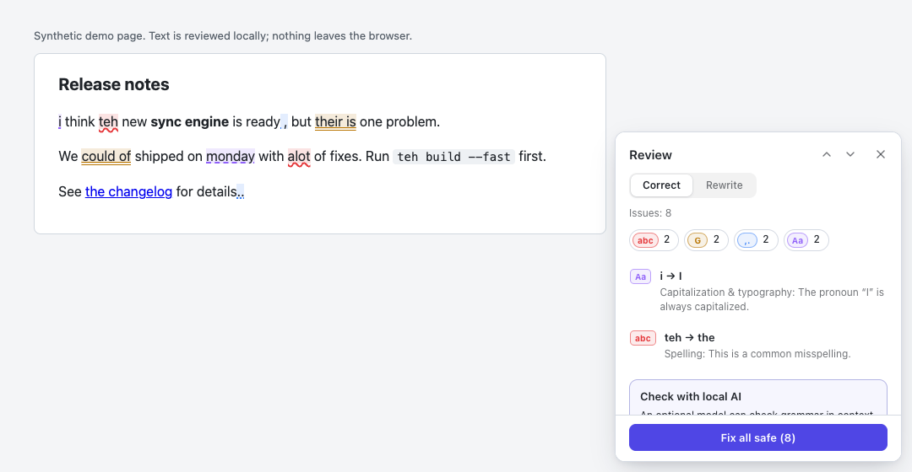
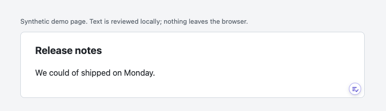
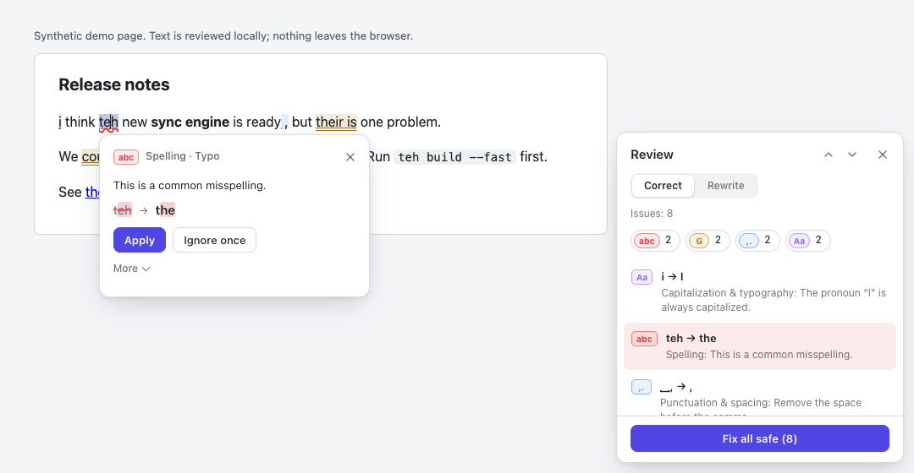
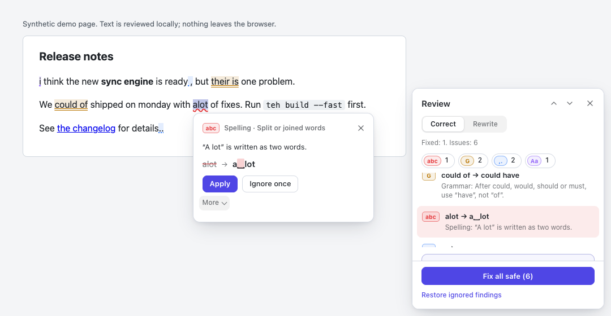
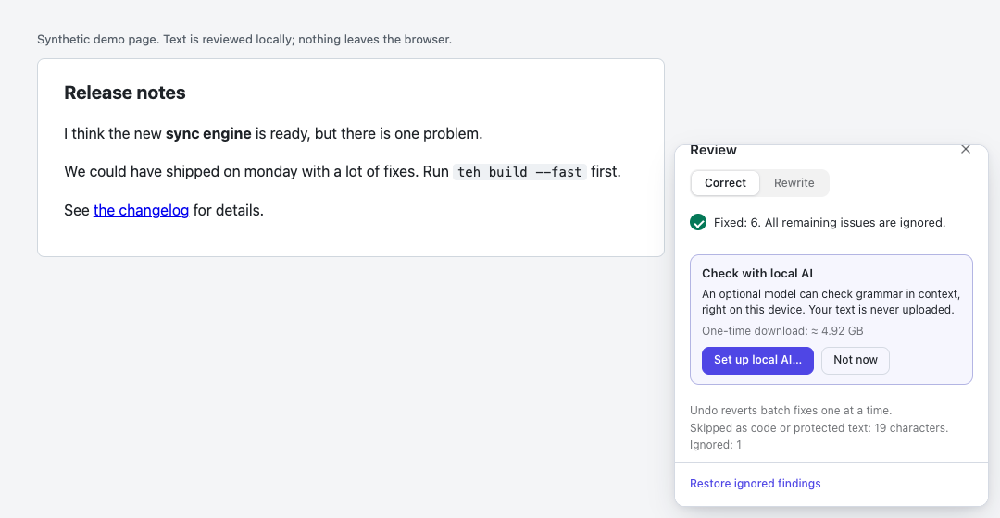
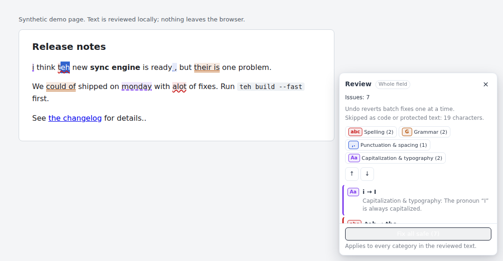
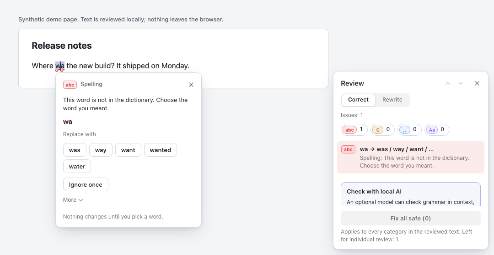

# Review Text

"Review text" proofreads text you have already written, in the editor you are
using, with local grammar and spelling checks and optional style advice. It runs
entirely in the page: no text leaves the browser, nothing is logged or stored,
and it needs no extra permissions.



## Using it

Put the cursor in a text field, then either:

- press **Alt+Shift+R** (the suggested shortcut; change it in the browser's
  extension shortcut settings),
- click the **Review** button in the corner of the text box you are writing in, or
- open the FluentTyper popup and choose **Review text**.

With several text boxes on a page, each of these reviews only the one you are
in (the one with the cursor); the others are never read or changed.
In Google Docs, use the shortcut or the popup; there is no Review button there.



The **Review button** is one small button, drawn in FluentTyper's own layer,
so the page's layout and the field's padding are untouched:

- It appears only on the focused **multi-line** field (text areas and rich
  editors, not search boxes or other single-line inputs), once the field
  holds some text, and only where review can run (not in sensitive, locked,
  code or very small fields, not in Google Docs, not in code mode).
- It hides while you type, comes back when you pause, and steps aside while
  that field's review is open. Clicking it keeps your cursor and selection, so
  a selection is reviewed on its own, exactly as with the shortcut.
- One icon per field: where FluentTyper waits for the "enable here" icon
  (a field with the browser's own autocomplete), that icon shows instead.
- It is not a tab stop; keyboard users have the shortcut. Turn it off under
  **Settings → Grammar → Review text**.

What gets reviewed:

- A selection wholly inside one editor: **that selection** ("Selection" in the panel).
- Otherwise: **the whole focused editor** ("Whole field"). Review never scans the page.
- A selection that crosses editors, a password, payment, security-code or
  one-time-code field (by type, `autocomplete` token, name or masking), and
  hidden, unrendered, read-only or disabled fields are refused with an
  explanation.
- In a modal dialog the review opens inside the dialog, so it stays usable.

Starting a review changes nothing: not the text, formatting, selection,
settings or learning data. Suggestions and typing-time corrections keep
working while a review is open; the review rechecks once you pause typing.
They pause only while the review writes a fix. Escape closes an open
suggestion popup first, then the card, then the review. In Google Docs,
typing-time corrections and suggestions still pause for the whole review.

### Highlights and the card

| Category                      | Color  | Line             | Badge |
| ----------------------------- | ------ | ---------------- | ----- |
| Spelling                      | red    | wavy underline   | `abc` |
| Grammar                       | amber  | double underline | `G`   |
| Punctuation and spacing       | blue   | dotted underline | `,.`  |
| Capitalization and typography | purple | dashed underline | `Aa`  |
| Optional style advice         | teal   | dotted underline | `S`   |

Color is never the only signal: each category also has its own line style and
badge, and the card and list name the category in words. The underline colors
keep at least 3:1 contrast on light and dark pages alike, whatever the OS theme. In forced-colors
(high-contrast) mode the highlights use system colors with the same line styles.

The card header also names the kind of problem a native check finds, for
example **Grammar · Agreement** or **Punctuation and spacing · Spacing**. Kinds
are finer than categories and are only a label: filters, colors and Fix all
still follow the category. The kinds are typo, split or joined words,
agreement, word form, confused words, usage, capitalization, repetition,
spacing, numbers and units, punctuation marks, redundancy, readability and
terminology. Dictionary spelling and Local AI cards show only the category.

Click a highlight, or choose a finding in the list, to open its card:
category, explanation, the change (original and replacement), any
alternatives, and **Apply**, **Ignore once** and, for single-word spelling findings,
**Add "word" to dictionary** (the existing FluentTyper dictionary).

Native and dictionary cards also offer **Ignore matching occurrences in this review**. It suppresses current findings with the same rule, language, normalized evidence and suggested edits, including the protected context. It is deliberately more specific than ignoring every use of a word. The visible hint explains that new occurrences are not automatically ignored. AI findings retain Ignore once only.

**Restore ignored findings** in the footer resets both kinds of session ignores. Counts, filters, navigation and Fix all planning use the remaining findings. Matching ignores track their occurrence and evidence with the existing position remapper: edits before unchanged evidence can move them, while evidence edits, protection changes, deletion/reinsertion or ambiguous placement release suppression. Close and reopen Review to clear every ignore. Another editor has its own session. No dictionary learning, setting changes, sentence hashes or reviewed prose are saved by either ignore action. **Disable this check in Review** remains a separate persistent preference.



The panel shows the scope, the count, per-category filters, previous and next,
close, and **Fix all safe (N)**. Fix all applies only the findings that are
visible under the current filters, whose rule is batch-approved, and whose fix
is proven not to conflict with another fix. Everything else stays for review
one by one. The line under the button says what Fix all covers.

| Ignore one finding                               | Fix all safe                                 | Native undo                            |
| ------------------------------------------------ | -------------------------------------------- | -------------------------------------- |
|  |  |  |

Note that `teh` inside the code span, the bold text and the link are untouched.

### Keyboard

- The panel takes focus when a review starts (except in Google Docs, which
  needs its own focus). **Tab** moves through the panel. Arrow keys move
  through the list. **Enter** or **Space** opens the card for a finding.
- **Escape** closes an open Local AI preview first, then the card, then the review. Focus returns to the editor.
- Pressing the shortcut again while the panel has focus keeps the review.
- In the editor, review never captures **Tab** or **Enter**.

### States

The panel names every state:

- **Loading:** "Checking…"
- **Results:** "Issues: N"
- **Nothing found:** "No issues found by the review checks"
- **Code mode:** "No review checks run in code mode."
- **All resolved:** "All found issues are resolved. Fixed: N."
- **Ignored:** "Ignored: N", and "All remaining issues are ignored." once nothing else is left
- **Paused:** while an IME composes ("Paused while you compose")
- **Stale selection:** after an edit at the selection's edge
- **Unsupported, review-only or sensitive editor:** says which
- **Partial coverage:** protected text skipped, the size limit, rules
  skipped for the language, paragraphs whose spelling was not checked because
  they look like another language, or (Google Docs, past 50,000 characters) text outside
  the window around the cursor, with the scope shown as "Part of the document"
- **Fix outcomes:** a fix the editor refused, or one it only partly applied
- **Error:** "Review failed. Close it and try again." (a scan that fails never
  leaves "Checking…" on screen)
- **Planning:** "Fix all safe (…)" while dependent fixes in a very large,
  error-dense text are still being proven; Fix all waits for the proof

## Proposals while typing

Typing rules fix only what is certain, and they fix it on their own. What
Review would apply one at a time (never in "Fix all") is offered while you
type instead, and is never applied without you:

- When you pause (about 220 ms), the Review checks run on up to 500 characters
  before the cursor. The newest finding that ends before the word you are
  typing, and that was not in the field when you entered it, becomes the last
  row of the suggestion popup: "is → are" and the short explanation (the full
  explanation is its tooltip). With suggestions shown inline, the popup holds
  only that row.
- The row is never preselected. **Tab**, **Enter** and **Space** keep
  accepting the first suggestion, or stay the page's when only the proposal
  shows. Move onto it with the arrow keys and press an accept key, or click it.
- Before writing, the span is found again, with the same fix, in the text as
  it is now; a changed or vanished span is never written. The fix is one edit
  that the undo shortcut reverts.
- Typing on, **Escape**, a click in the field or leaving it dismisses the
  proposal. A dismissed or shown span is not offered again while the page is
  open.
- Only native checks with a single fix are proposed: never dictionary
  spelling, Local AI, warnings or choices between several fixes, never what
  "Fix all" could apply (the typing rules cover that), and never a check a
  typing rule already runs while that rule is on. They follow the Review
  switches and the language, as Review does. Sensitive, locked and code fields
  and code mode get none, and nothing is sent anywhere.
- Turn it off under **Settings → Grammar → Review text → Show grammar
  proposals while typing**. Google Docs has no proposals; use Review there.

## Rules and categories

Review reuses the typing-time rules' own patterns, word lists and helpers.
Each catalog rule is classified in
[`reviewCatalog.ts`](../src/core/domain/grammar/review/reviewCatalog.ts), and
its `Record` type makes an unclassified new rule a compile error: every
supported rule names its category and kind, and every excluded typing rule its
category. Native Review checks have independent switches in
**Settings → Grammar → Review text**. They are listed under the Review
categories, each card badged with its kind, "Off by default" for optional
checks and "English only" where that applies. Typing switches are listed under
the same categories.
Core checks default on. The optional style and typography checks (long sentences, redundancy, wording advice, the ellipsis character, typed dashes, prime marks) default off; restoring defaults
keeps them off. Typing switches still control only automatic corrections.
A native finding's **Disable this check in Review** action saves that rule's choice
and refreshes open reviews. Restore it in settings, individually or with **Restore defaults**.
Disabling every native check leaves dictionary spelling and separately configured Local AI available.
Code mode disables Review checks.

Only supported native rule IDs and boolean choices are stored. Missing choices
inherit explicit catalog defaults; malformed known choices are disabled and unknown
IDs are discarded. Existing typing preferences are never migrated into Review choices.
No reviewed text is stored by these controls.
Each rule runs only in the languages it supports, and the panel says how many enabled
rules were skipped for the language. Some English rules have Review-only tables for
other languages (doubled comparatives, merged words, French elisions, German day and
month capitals, fixed phrases, compounds and common misspellings); those findings are always individual-only. The full rule × language
matrix, with the reason for every unsupported cell, is in
[review-language-matrix.md](review-language-matrix.md). With the language
set to auto-detect, Review first identifies the text's language on the device (the
browser's own detector) and uses the matching enabled language, or the fallback language.

Supported (**Typing** is the rule's default for typing; Review has separate switches):

| Rule                                   | Language       | Typing      | Category    | Kind               | Fix all                                                                                                                                        |
| -------------------------------------- | -------------- | ----------- | ----------- | ------------------ | ---------------------------------------------------------------------------------------------------------------------------------------------- |
| `englishExistentialAgreement`          | English        | unavailable | grammar     | agreement          | individual only                                                                                                                                |
| `englishThenThan`                      | English        | unavailable | grammar     | confused words     | individual only                                                                                                                                |
| `englishYourYouAre`                    | English        | unavailable | grammar     | confused words     | individual only                                                                                                                                |
| `englishTheirThereTheyAre`             | English        | unavailable | grammar     | confused words     | individual only                                                                                                                                |
| `englishToToo`                         | English        | unavailable | grammar     | confused words     | individual only                                                                                                                                |
| `englishWereWhere`                     | English        | unavailable | grammar     | confused words     | individual only                                                                                                                                |
| `englishAuxiliaryBaseVerb`             | English        | unavailable | grammar     | word form          | individual only                                                                                                                                |
| `englishPronounCase`                   | English        | unavailable | grammar     | word form          | individual only                                                                                                                                |
| `englishSentenceStructure`             | English        | unavailable | grammar     | usage              | individual only                                                                                                                                |
| `englishRepeatedWords`                 | all            | unavailable | grammar     | repetition         | individual only                                                                                                                                |
| `englishPhraseCorrections`             | 9 langs        | unavailable | grammar     | usage              | individual only                                                                                                                                |
| `englishClosedCompounds`               | 6 langs        | unavailable | spelling    | split/joined words | individual only                                                                                                                                |
| `capitalizeSentenceStart`              | all            | on          | typography  | capitalization     | yes (after a quote or bracket closing a period: individual only)                                                                               |
| `capitalizeAfterLineBreak`             | all            | on          | typography  | capitalization     | individual only: line starts in poems, lists and hard-wrapped text are often lowercase on purpose                                              |
| `englishPronounICapitalization`        | English        | on          | typography  | capitalization     | yes                                                                                                                                            |
| `englishContractionNormalization`      | en, fr, de, pt | on          | spelling    | typo               | English yes (an apostrophe typed as `;` or a backtick: individual only); French elisions and other languages' apostrophe marks individual only |
| `englishTypoWhitelistCorrection`       | English        | on          | spelling    | typo               | yes                                                                                                                                            |
| `englishModalOfCorrection`             | English        | on          | grammar     | confused words     | yes                                                                                                                                            |
| `englishYourWelcomeCorrection`         | English        | on          | grammar     | confused words     | yes                                                                                                                                            |
| `englishTheirThereBeVerb`              | English        | on          | grammar     | confused words     | yes                                                                                                                                            |
| `englishAlotCorrection`                | 8 langs        | on          | spelling    | split/joined words | English yes; other languages' merged words individual only                                                                                     |
| `englishPronounVerbWhitelistAgreement` | English        | on          | grammar     | agreement          | original pairs only; expanded forms and contextual "you was" are individual only                                                               |
| `englishArticleAnCorrection`           | English        | off         | grammar     | agreement          | individual only: initial-sound heuristic; a letter, name or identifier can look like an article                                                |
| `englishOrdinalSuffix`                 | English        | off         | typography  | numbers and units  | yes (a capitalized suffix such as "2ND": individual only)                                                                                      |
| `englishProperNounCapitalization`      | en, de         | on          | typography  | capitalization     | English yes (German nouns individual only; months that need a date as evidence: individual only)                                               |
| `measurementUnitFormatting`            | all            | on          | punctuation | numbers and units  | individual only: units in technical prose are meaning-sensitive (also "°K" → "K")                                                              |
| `currencySpacing`                      | all            | on          | punctuation | numbers and units  | yes (English "25$" → "$25": individual only)                                                                                                   |
| `commaPeriodSpacing`                   | all            | on          | punctuation | spacing            | yes (Greek `;`, Arabic `؟ ؛` and Spanish `¿ ¡` padding: individual only)                                                                       |
| `collapseRepeatedSpaces`               | all            | on          | punctuation | spacing            | yes (alignment gaps and Markdown table padding are left alone)                                                                                 |
| `duplicatePunctuationCollapse`         | all            | off         | punctuation | repetition         | yes (a four-dot ellipsis: individual only)                                                                                                     |
| `ellipsisShortcut`                     | all            | off         | typography  | punctuation marks  | individual only; off by default in Review (optional "…" for "...")                                                                             |
| `emdashShortcut`                       | all            | off         | typography  | punctuation marks  | individual only; off by default in Review (optional dash for "--" or "---")                                                                    |
| `primeSymbols`                         | all            | unavailable | typography  | numbers and units  | individual only; off by default (optional ′ ″ for "5'7\"" and "48°51'")                                                                        |
| `quoteSpacing`                         | all            | unavailable | punctuation | spacing            | individual only: a straight quote does not say which side needs the space, so both are offered                                                 |

Agreement retains the six original typing pairs and their existing bulk rules.

`englishArticleAnCorrection` picks a or an by the next word's initial sound, not its spelling: a silent h (an hour, an honest), u, eu and one said with a consonant (a university, a European, a one-way street), and initialisms by letter name (an HDMI, a USB). It abstains when both articles are heard or the sound is unknown (SQL, NASA, herb, historic, ukulele, numbers), on mass nouns (a information), single lowercase letters, short or unpronounceable lowercase initialisms (an sla, a usb), user-dictionary words, quoted words, code and paths. Typing checks lowercase words only and stays off by default; Review also checks capitalized words and initialisms, individual-only.
`englishContextualCompounds` is a separate Review-only check for curated compound pairs. It splits everyday into every day after a complete listed pronoun-led action, and splits login/setup into log in/set up in explicit modal, infinitive or please-imperative slots with complete listed complements. New spaces use the existing grapheme-anchored editor transaction; unrelated formatting remains intact. Findings own their spans before dictionary spelling runs, so the same token does not receive redundant spelling cards. Presage candidates and ranking are unchanged.

Noun/adjective uses such as everyday tasks, the login and the setup are preserved. This check does not join two-word noun spellings or impose a login/log-in or setup/set-up house style. Unknown compounds, incomplete contexts, command arguments, URL components, mixed-case identifiers, capitalized product-name candidates and user-dictionary words abstain. The listed lowercase tokens, including aswell after tested/checked/reviewed, are split; every finding remains individual-only and typing is unchanged.

The established-usage check covers for all intensive purposes before a known completion clause, one in the same in explicit plural identity clauses, and peak/peaks/peaked/peaking someone’s interest with known subjects, modals and progressive auxiliaries. It also recognizes bounded indirect-question, pronoun-case, lexical-confusion and malformed finded constructions; meaning-ambiguous effect/affect uses abstain. A negated verb (didn't/don't/can't/never + have/want/need/see/know…) before "no" + a word offers "any" ("didn't have no idea"); "take no for an answer", "say no", "no one", "no longer" and "no matter" abstain. "few" + a time unit + "ago" gains its article ("a few days ago") unless a/very/only/the/last… precedes it. Case, tense, possessive determiners and surrounding whitespace are preserved. The phrase-matching loop is shared with fixed prepositions; there is no general search/replace engine or external phrase database.

Literal peak meanings and locative one in the same room, unrecognized frames, recognized creative/dialect cues, named quotations, technical tokens, dictionaries and protected text abstain. These are grammar-category cards with usage-specific explanations, independently configurable and individual-only. Native spelling-span ownership prevents duplicate spelling cards. Typing and existing modal-of corrections are unchanged.

The doubled-degree check removes redundant more/most only in complete this/that/it or known-noun clauses with is/was. It uses the ten explicit comparative words of the copular then/than frame, plus easier/simpler, and eleven explicit superlatives. Supported tails are bounded to known to-infinitives, known comparison targets, ungrouped integer targets, or a complete sentence ending; superlatives require a known noun. Numerical values and comparison targets are preserved. A then/than error can become detectable after removing the redundant degree marker; the normal snapshot recheck supplies fresh offsets and invalidates the previous card.

Quantity phrases, hyphenated noun modifiers, heading fragments, quoted examples, unknown degree forms, capitalized names and mixed-case identifiers abstain. Valid multiword adjectives, very unique, far better and repeated emphatic better and better are untouched. No suffix inference, style enforcement, typing correction or Fix all eligibility is added. The rule can be disabled independently in Review settings.

The native countability check covers ordinary-prose malformed plurals of information, advice and equipment in bounded complete frames: a page/guide/report/document contains/provides/includes useful information; thanks/appreciation for helpful advice; and we/they/you need/use/bought/ordered/checked/tested specified equipment. Small adjective lists supply context. It also repairs criterion/criteria and phenomenon/phenomena after explicit one–ten or single-digit counts, preserving the count exactly. These special noun pairs stay within the individually suppressible countability family rather than expanding the shared general noun-number rule.

Specialist legal, banking, commercial, regional and archaic evidence in the bounded context causes abstention. Quoted examples, identifiers, capitalized names and dictionary words are protected. Known quantified feedback/information/advice and a information frames can show a warning without an edit; other quantified mass-noun constructions abstain. No unit, amount or partial determiner repair is invented. Data agreement, fewer/less preferences, coffee, experience, work and paper are outside this check. All findings are individual-only; typing is unchanged.

`englishNounNumber` is a separate native Review-only check using the shared authored noun-pair map (now including device/devices). It handles complete `one of the` clauses, explicit counts zero–ten or up to four ungrouped digits, and these/those followed by a known singular noun and a supported predicate. Explicit counts retain their value and change only noun inflection; `one of the` pluralizes the set noun while leaving its outer singular subject and verb untouched. `one of the/my/these…` with up to three free modifiers before a known singular noun also pluralizes it when the noun ends the phrase (a clause end, a verb such as is/has, a pronoun or a preposition follows), so "one of the file formats" abstains. Decades and round plurals written with an apostrophe become plain plurals: "the 1960's" or a four-digit decade before a clause end becomes "1960s", "the 90's" offers "'90s" or "90s", and "100's of" becomes "100s of"; years and versions with a possessive ("Windows 10's", "1977's best month", "2020's biggest hits") abstain.

For these/those, a following are/were establishes plural and is/was establishes singular. Past predicates such as failed/arrived/returned do not establish number: the existing choice-card UI offers either pluralizing the noun or changing the demonstrative to this/that, with nothing preselected. All findings remain individual-only. Complete bounded predicates/locations prevent noun-modifier edits such as `those file names`. Unknown/invariant nouns, data/news/series, units, ordinal tokens, grouped/decimal/fractional numbers, technical model labels and hyphenated measurements abstain. Quantity repair can make a separate existential-agreement finding available on the next scan; it never changes the number to fit the verb.

`englishPerfectParticiples` is a separate Review-only check for have/has/had/having (after any subject, a modal or `to`, in questions such as "Have you ate?", and in `'ve`, `'s` and dropped-apostrophe forms such as `youve`, `hasnt`) followed by a known simple-past form whose participle differs ("has went" → gone, "Having went", "would have took"); prefixed pasts the dictionary lists as plain words borrow their stem's row ("outgrew" → outgrown). It changes only that verb. `'d` is had or would, so it offers the participle and the base verb as a choice ("I'd took" → "I'd taken" / "I'd take") unless they coincide. Up to two adverbs (a closed list or a lexicon-only -ly adverb) may come between. A past that is also a noun or adjective ("saw", "rose", "fell", "broke") is a verb only when no noun can follow it ("have saw that", not "have saw blades"). An auxiliary that closes a clause modifying a head before it ("Everything we had went into it", "the cat I had ran off") is a main verb and abstains, and so does a pronoun whose have/has disagrees, left to the agreement check with the participle reconsidered on the next scan. The same check flags have/has/`'ve` right before an -ing verb with an object or determiner ("I've looking into it", "She has cleaning the kitchen") and offers a choice between be ("I'm looking") and have been ("I've been looking"). -ing words that are also everyday nouns (training, reading, meeting…) need an object pronoun, and modals or question words before have abstain. It also covers be: any subject, then be/being/been/am/is/are/was/were (with n't, a modal or `to`, inverted in questions, or a pronoun's 'm/'re/'s) before a simple-past-only form gets the participle ("The car was stole" → stolen, "can be saw" → seen, "He's went" → gone, since has and is both take it). Adjective readings abstain ("I am broke", "The movie is woke") unless a particle follows ("was broke into", "was woke up") or a thing is broke ("it's broke", "Now its broke and…"); ambiguous forms other than stole/saw, verbs without a passive (came, went, became…) unless the be is a has-'s, "did" ("The question is did he go"), noun-clause subjects ("What it was took courage"), the noun being ("a human being stole it") and a clock "am" abstain. A clause-initial I/you/we/they/he/she + am/is/are (or 'm/'re/'s, optionally not/also/just/still/really) before a bare verb offers a choice between the progressive and the simple present ("I am go" → "I am going" / "I go", with do-support after not). The word must be provably a verb: an irregular base whose past and participle both differ from it, followed by a word that is not a compound (-ed/-ing/-s), or a regular base by spelling that is followed by me/him/us/them or the/a/an/possessive + a non-time word. A closed set of prepositions, adverbs and complement-taking adjectives (sure, glad, afraid, free, mean…) and adjective-shaped endings abstain; findings are choice-only and never batched.

Possessive and causative have, noun uses such as `have saw blades` and `have rose bushes`, shared lemma/past or past/participle forms (beat, read/cut/set), names ("have Drew"), unlisted morphology, possessive `'s` on nouns and `its` before a modifier abstain. Regional learned/learnt, burned/burnt, got/gotten and other unlisted forms remain untouched. Existing auxiliary, spelling and typing behavior is unchanged; findings stay individual-only.

`englishVerbComplements` is a separate Review-only check for complete pronoun-led complement frames. It inserts `to` after audited need/want/plan forms before a known base verb with a listed argument. Fourteen lexical argument frames cover fix a specified bug, deploy today/tomorrow, meet a person, make the change, take a break, write the report, run the tests, come/go home, see the results, learn a listed language, visit the office, read the file and send the message. Optional do-not/don't negation is preserved. Contractions accept straight or curly apostrophes.

Inflection frames take their verb forms from the shared helpers (`englishLemma`/`englishInflect`) and the part-of-speech lexicon (`englishWordInfo`), and abstain whenever they cannot decide. A word counts as a base verb only when the lexicon lists a base reading and no other verb's form (`found`, `saw` abstain); a verb that is also a noun or adjective (`work`, `try`) needs more evidence than a verb-only word (`hear`, `investigate`).

- `look forward to` + base verb → -ing (`I'm looking forward to meet you`, `We look forward to hear from you`), after a subject pronoun or pronoun + be with inflected, progressive, perfect, stressed (`really`), negated or contracted forms, and in a subjectless `Looking forward to` sign-off when a person pronoun or `from` follows the verb. A noun-verb needs an object pronoun or determiner after it, `from` + object after an irregular verb, or one of the fourteen listed arguments (`to dinner.`, `to spring`, `summer a lot`, `work the next day` abstain); a bare `Look forward to see the road` and `The camera looks forward to detect` look ahead and abstain.
- `worth to` + base verb → `worth` + -ing (`It's not worth to fix it`, `Is it worth to add`, `ideas worth to explore`), and be + `worth of` + -ing drops `of`. `worth` after a determiner, possessive or adjective is a noun (`its worth to society`, `true worth to the team`, `net worth of`) and abstains. A noun-verb needs a dummy `it`/`this`/`that` subject (also `doesn't seem worth`, `Is it worth`), an object, a preposition or the clause end; recipients (`worth to people who`, `worth to investors`) abstain.
- let/make + object + `to` + base verb drops `to` (`Let me to do it`, `let anyone to help`, `lets users to edit`, `let's you to rename`), past a focus or -ly adverb (`let it to only load`). Indefinite pronouns (`anybody`, `every one`) count for both; a determiner phrase or bare plural only for let, since `made a trip to see her` is a purpose. `Made it to` (reached) abstains; after `it`/`them` or a noun phrase, renting (`let it to students`, `let the flat to students`) needs a verb-only word, an irregular verb or an object after it.
- `allow(s|ed) to` / `enable(s|d) to` + base verb with no object offers a choice of -ing or `you to` + verb (`them` when the subject is `you`). `Allowed`/`enabled` must follow a subject pronoun, so passives and questions (`are allowed to`, `Are you allowed to`, `Users allowed to edit`) abstain. Bare `Allow to`/`Allowing to` need a noun phrase after the verb (`Allow to change the password`), so recipe imperatives (`allow to cool`, `allow to rest 10 minutes`) and adverbs (`allows to further reduce`) abstain; a bare `Enable to` is a UI label and abstains.
- `went ahead and` + base verb → past, `gone ahead and` → participle, `goes ahead and` → -s form, and `go ahead and` + past → base. Verbs whose past equals the base (`put`, `set`) and other verbs' forms (`found`, `saw`) abstain; a noun-verb followed by a verb starts a new clause (`went ahead and rain fell`) and abstains.
- help + past/-s form → base, with or without an object (`I helped built it`, `She helped me fixed it`, `This helps reduces`), and help + (object +) `to` + past or -ing form → base (`helps us to understood`, `helps to fixed`). The words before help must show it heads its clause: a relative or reduced relative clause that could be a subject (`Everyone who helped got`, `The people we helped moved`, `I heard the families we helped moved`) abstains unless its noun phrase follows a preposition, `have` or `is a(n)` (`a startup that I helped built`); passives (`can't be helped given`), noun `help`/`helping` and words that are also base verbs (`helped them found a company`) abstain. Without an object, a past form that is also a participle needs a verb's continuation (an object, determiner, quantifier, number, preposition, `and` + verb or the end), so adjectives (`helped injured people`) abstain; served food (`helped them to drinks`, `to baked potatoes`) abstains.
- suggest/recommend/avoid/enjoy/consider/finish/mind + `to` + base verb → -ing (`I suggest to use`, `Avoid to use`, `Would you mind to close`, `I'm considering to buy`). Passives (`it's strongly recommended to`, `is considered to be`) abstain; -ed forms, consider, finish and mind need a subject pronoun (mind also a negation or question), so `the dosage recommended to treat`, `keep in mind to` and `a mind to quit` abstain; suggest/recommend take recipients (`suggested to the team`), so a noun-verb needs an object after it.

A closed function-word list keeps determiners, pronouns, prepositions and degree adverbs from being read as verbs. An additional bounded frame covers decide. Gerund content clauses after decide and restrictive participles after allows (`allows users editing their text to continue`) remain protected: the allow frame never rewrites an object + participle.

Outside the subjectless forms named above, these checks abstain on subjectless fragments/headings, incomplete or unknown arguments, noun readings such as `need work` and `need input data`, existing infinitives/gerunds, `need not`, and optional/forbidden-to frames such as `help fix`, `let me know` and `make it work`. They do not infer gerunds by adding a suffix. Missing `to` uses the existing one-grapheme insertion anchor, retaining the following verb's formatting; no adapter bypass is used. Malformed auxiliary forms remain owned by the auxiliary checker. Every finding is individual-only; typing behavior is unchanged.

`englishFixedPrepositions` checks established constructions in bounded contexts. It removes `of` plus its following horizontal separator after `despite` before a complete listed noun phrase; removes `about` plus its separator after pronoun-led `discuss/discussed/discusses` or be + `discussing`, or `please discuss`, before a complete listed topic; and changes `on` to `in` in pronoun + be + `interested on` before a listed activity/topic. Additional frames cover responsible for, duration for/since, arrive at, wait for and investigate, with known predicates and objects. Complete phrase evidence and punctuation/end boundaries are required. Known adjectives are bounded; multiline and protected evidence abstain.

This is not a global preposition replacement. Approximate quantities (`discussed about five issues`), embedded questions (`discussed what the book was about`), noun uses (`discussion about`), temporal/location attachments (`interested on Monday`, `interested on screen`), incomplete complements and unlisted objects remain untouched. Existing correct `in spite of`, `talked/asked about`, `interested in` and `depends on` are preserved. Findings stay individual-only and do not alter typing.

Three native Review-only contextual apostrophe checks are independently configurable:

- `englishItsContext`: possessive `its` after a listed transitive verb and before a complete known noun phrase, or in a clause-opening noun phrase with a supported predicate. Conversely, clause-opening `its` before listed complete predicates such as `ready to use`, `cold outside`, `working now` or `been fixed` becomes `it's`. `its` directly before a verb, article, pronoun or function word (`its been`, `its a`, `its not`, `its never`, `its always`, `its someone`) is always `it's`; a clause-opening `its` before a listed adjective and to/for/that or a clause end (`Its important to…`), and `its` + a capitalized name after think/hope/guess (`I think its Priya.`) become `it's`. `it's` after a preposition (`in it's sandbox`), before `own`, before an ordinal after an -ed verb, or opening a clause before a word and are/were/have (`It's wheels are…`) becomes `its`.
- `englishLetsContext`: clause-opening `lets` before a complete listed suggestion such as `try again`, `go home` or `take a break` becomes `let's`. Lexical `lets` with a subject is preserved.
- `englishElsePossessive`: `elses` after someone/somebody/anyone/anybody/everyone/nobody/no one and before a complete known noun phrase becomes `else's`. Capitalized `Elses` is preserved as a possible name.

All three change only the target token, remain outside Fix all safe, and leave existing contraction normalization and typing untouched. Existing straight or curly apostrophes are accepted for possessive `it's`; new apostrophes follow the existing normalizer's straight-apostrophe convention. No global quote normalization occurs. Evidence uses bounded horizontal spacing, listed nouns/adjectives/predicates and a phrase boundary. Unknown noun phrases, unlisted predicates, arbitrary names, singular/plural owners, multiline evidence and technical tokens abstain. Named quoted examples are protected; supported ordinary nested quotations remain eligible. These are bounded recognizers, not general ownership inference.

Additional Review-only constructions run under `englishPronounVerbWhitelistAgreement`:
clause-opening we/they/you with is/am/was/has/does, and he/she/it with are/am/were/have/do,
and "I" with are/is/does (anywhere except after a capitalized word or and/or/nor, as in
"Part I is" or "Sam and I are"). A clause-opening pronoun before a verb from the authored
irregular table also agrees: "He always forget" becomes "forgets", "They goes" becomes
"go"; forms shared with the past or a noun ("He cut", "They bear") abstain. The phrase
may end at punctuation ("It don't."). One listed adverb (really, still, also, always,
never, usually, often, just) may intervene. These new forms
change only the finite verb, retain negation, and are individual-only. Object
pronouns, coordinated subjects, subjunctives after a preceding clause, named quoted
examples, technical/mixed-case identifiers and unfinished phrases abstain.

The independent `englishExistentialAgreement` check recognizes clause-opening
There is/are/was/were + optional not/still/also + an explicit quantity, many/several or a lot of + a known countable noun,
optionally with one listed adjective and a simple location phrase. Quantity and
noun number must agree before the verb can be repaired. Its authored noun pairs
include about 50 irregular plurals (child/children, woman/women, criterion/criteria);
same-form and shared plurals (sheep, axes) are left out and no noun suffix guessing is used.
Known plural phrases may continue with that/which/with. Unknown, collective and
invariant-number nouns, coordinated subjects, singular relative clauses, hard-wrapped
continuations and contradictory quantity/noun combinations abstain. The quantity, noun, adjective and negation are never rewritten.
The noun pairs also list about 80 everyday regular count nouns (thing, issue, bug, example, user, day…).
A known plural noun right after existential there ("there is warnings", "there's bugs",
"Is there examples…?") changes only the verb to are/were. A known singular noun after
there are/were (or opening "Are there…") followed by a preposition, that/which or a clause
end offers a choice between "there is a bug" and "there are bugs". "there" must open its
clause or follow a conjunction or a verb such as think/see; "Over there is…" and
"the idea there is…" abstain.

Contextual word confusions have five independent Review-only identities:

- `englishThenThan`: a copula, a listed comparative and a complete comparison
  argument (a known noun phrase or object pronoun); a listed comparative before
  an object pronoun or "ever"/"usual"; "X rather then Y"; "easier said then done".
  Temporal "then", unknown noun phrases, following finite clauses, "would rather
  then" and sequences such as "earlier then him" abstain.
- `englishYourYouAre`: clause-opening "your going to" with a listed verb and
  object, or an object-taking verb followed by "you're own" and a known noun.
  Possessive gerunds ("your going away", "I dislike your going…") abstain.
  The clause-opening they're frames below also apply to "your" ("I hope your safe
  there", "Your very patient.", "when your out of the meeting"); "going to" needs the
  rest of its clause as plain words on one line.
- `englishTheirThereTheyAre`: the same bounded future construction for
  "their/there going to", and "there/they're own" before a following word ("there own"
  needs a clause start, preposition or listed verb before it, so "people there own cars"
  is kept). A clause-opening "their" (or one after think/heard/because…) before a listed
  predicate plus a function word ("Their not ready for…", "Their in the garage"), an
  article, or modal/perfect/negative "be" ("Their won't be…") becomes "they're" or
  "there"; "their's a/no/the…" becomes "there's"; "their" after a place verb before a
  preposition or clause end ("waited their until", "been their.") or directly before a
  preposition phrase becomes "there"; "they're" after a preposition or before a word
  plus is/was/has ("They're tickets were…") becomes "their". Gerund subjects
  ("Their going to school took an hour") abstain.
- `englishToToo`: copular "to + listed adjective + to + listed verb". Ambiguous
  adjectives that are also verbs ("fast", "slow", "light") are not included.
  Review also reads "to" as "too" after a linking verb before a listed degree adjective
  followed by to/for or a clause end ("Life is to short."), in "went/spoke to far/soon"
  and in "way to much/long" (not after the/a/this…), and "too" as "to" before a
  determiner or object pronoun ("too the station") or a bare verb after want/need/going
  ("need too leave").
  "every" between an auxiliary + subject pronoun and a following word ("Did you every
  try…") becomes "ever"; time nouns ("Did you every day…") abstain.
- `englishThenThan` also covers listed -er comparatives, more/less + a word (not an -er
  comparative, which the degree check owns first), "other" after nobody/nothing…, and
  "rather", when "then" is followed by an object or possessive pronoun, ever/before/usual,
  a number, or a short noun phrase ending at a clause end or preposition; it abstains
  after if/when/once/unless in the same clause and before -ed words ("then the old
  version failed"). "now and/until/since/by/back than" at a clause end becomes "then".
- `englishWereWhere`: "we/they/you where" before a listed predicate ("They where going",
  "you where right") becomes "were", except after show/tell/know… ("show you where");
  "were" after know/forgot/find/check… and before a subject pronoun or "the X is/was"
  ("Do you know were they went?") becomes "where".

These checks replace only the confused word and record the surrounding evidence.
They do not depend on dictionary misspellings. Existing "your welcome" and
"their is" checks retain sole ownership. Named quoted examples, technical glue,
protected islands and newline-spanning constructions are excluded. These finite
lists provide bounded coverage, not a general homophone or English parser.

Auxiliary verb forms are Review-only. An authored table covers about 140 common
irregular verbs; regular -s/-ed/-ing forms go through the shared English inflection
helper and the dictionary lexicon, and words the lexicon does not know abstain ("containg").
Pronoun-led clauses, inverted questions (pronoun, this/that, or a determiner + up to three
nouns/adjectives, optionally after what/when/where/why/how/who: `Can the server handles it?`)
and a clause-initial determiner + one lowercase noun (`The server did logged it`) support
do/does/did, modals, straight/curly negative contractions, and up to two listed intervening
adverbs. Mid-sentence, any subject word before a modal or a negative do contraction counts
(`duplicate keys will throws`, `users can't logged in`), and pronoun + 'll/'d anywhere ('d
offers would or had: `they'd went` → `go` / `gone`). The auxiliary, subject and negation are
preserved. A bare will/can/may/must/might after a determiner, possessive, preposition,
ordinal, adjective, -ing/-ed word or inversion trigger (nor, only, when…) is read as a noun or
an inverted clause ("his will needs", "free will", "military might", "nor will users"); bare
"can" also needs a plural or pronoun subject ("the trash can smells"). A plural-noun -s form
before a bare verb ("they must needs come", "should costs rise") and a participle before a
noun after "should" ("should affected users call") abstain. Affirmative do can be the main
verb, so a regular form after it needs an object pronoun (or, for -ed, a determiner) as verb
evidence: "did tests on it", "did advanced training" and "do reviews" stay silent. A modal +
-ing (`I will walking`) and a modal + -ed without that evidence (`We should updated.`) offer a
choice between the base form and adding "be"; -ing words that are everyday nouns abstain.
Table homographs (`saw`, `found`, `left`, `bit`) after do become a choice, never after a modal
("can saw wood"); "lay" is both lay and lie and stays silent. "didn't supposed to" and modal +
"used to" abstain. Noun readings such as "do works"/"did builds", mixed-case identifiers,
protected text, and directly named quoted examples are left alone.
The same rule repairs a verb form after "to" (optionally split by an -ly adverb): `want to
went` → `want to go`. A closed set of infinitive heads (want/need/have/try/decide + to,
able/supposed/ought/planned to, would like to, be + going to) licenses any form; a plural-noun
-s form there still needs an object pronoun, a determiner (not after "going") or a clause end
("need to funds released" abstains). A verb-only -s form or a past-only irregular form also
follows be + a participle or adjective (`is expected to exists`). Any head works when a
determiner or object pronoun follows the form (`To explained the rules`). Regular -ed and
participles after other heads are states ("set to disabled", "from draft to published",
"going to advanced classes"), stranded prepositions ("the page it links to exists") abstain,
and -ing after "to" always abstains.
need/want + to + a noun the lexicon gives no verb, adjective or adverb reading (`I need to
information`) offers a choice between "the" + noun and the bare noun. Words with a verb reading
or a listed -ing/-ed form ("need to permit", "need to override"), unknown words without a
-tion/-ness/-ity… ending ("need to backup"), nouns followed by a noun, determiner, object
pronoun or bare verb ("want to proxy websockets", "need to unit test"), and "the need to" abstain.
Clause-internal subordinate do ("What I did works") and newline-spanning phrases are outside
this scope. Existing modal-of and agreement checks retain their ownership.

`englishPronounCase` is Review-only. A clause-initial coordination with an object
pronoun (me/him/her/them) directly before a finite verb (an auxiliary, a listed
irregular past or an -ed form) takes the subject form, with "I" last and a singular
be/have/do made plural ("Me and him was there" → "He and I were there"). Only a sentence
start or a short opener ("Yesterday", "Last Monday", "Then,") counts; objects
("between you and me", "He told Sam and me") and "Her and my parents" abstain. "whom"
directly before its own verb ("Whom is coming?", "Whom can of course help?") becomes
"who"; before do-support or another subject ("Whom will you invite?") it is left alone.
After a preposition it changes only in an active perfect or modal ("to whom has
replied") or after "the + noun of" ("the question of whom is allowed"); partitives
("most of whom were", "the eldest of whom was") abstain. "whomever/whomsoever" take
their case from their own clause, so a finite verb after them makes them
"whoever/whosoever" even after a preposition ("to whomever wrote it"). A subject
pronoun after a non-clausal preposition takes the object form ("to he and his team",
"to we developers", "with Sam and I." → "Sam and me"; "for", "like", "than" and
inverted "In they went" abstain), and a clause-initial "Us developers are" becomes "We".

`englishSentenceStructure` is Review-only. It offers a choice for two clause-initial
subject pronouns ("I he went"), a preposition with two object pronouns ("to you them"),
an article before a possessive ("the my car", also bare "the my"; "a/an her", "the my
keyword" and labels such as "the My Account page" abstain), a possessive or "a" before
"the" ("my the car", "a the bus"; "your/their the" also offers you're/they're, and its
clause-opening form belongs to those rules) and stacked possessives ("my your idea"). A
possessive before a subject pronoun ("about my I want") is a warning without a repair.
Any two different modals after a subject pronoun, "ought to" included, are a double
modal ("I might could go", "You should ought to call"; a base verb must follow, so
canning stays). It inserts "be" between a modal and a word the lexicon knows only as an
adjective before a clause end or a listed follower ("It would nice if…"; "kind of" and
listed adverbs abstain), "of" after "a couple/a lot/a bunch/a handful/plenty" before a
plural (an -s word that is also a verb needs "ago" or a preposition before it, and "a
lot" needs its noun to close the phrase), offers "many people"/"many of the people" for
"many of people", and inverts a fronted "not only" ("Not only it is", "because not only
we're", "Not only it works" → "does it work"), abstaining when the next clause names a
different subject ("Not only you know it, everyone does"). `englishUsagePhrases` also
reads a clause-initial pronoun + "new" before that/it/what/a pronoun… as "knew", and
"I/he/she/they (+ adverb) new + word" anywhere unless a copula comes first ("Is she new
to…"), the clause is gapped ("…and she new") or a verb follows the noun ("they new hires
are").

Repeated words are Review-only: a bounded per-language allowlist of closed-class
words (English articles, prepositions, `and`, `or`, `but`, `nor`, `as`, `than`,
`this`/`these`/`those`, `its`/`your`/`our`/`their`, `is`/`are`/`was`/`were`,
`has`, `been`, `would`/`should`/`could`; plus short lists of articles,
prepositions, conjunctions and demonstratives for every other supported language)
separated by 1–8 spaces, tabs or no-break spaces. The first word keeps its casing; one
suggestion deletes one duplicate and its separator. Longer runs recheck after
each repair. Newlines, hyphens, protected islands, dictionary words and directly
named quoted examples are excluded. This intentionally misses arbitrary repeated
words ("very very", "record record profits": without a part of speech a slip
cannot be told from emphasis or a homograph) and distant metalinguistic context;
it is not a general repetition parser.
Words that legitimately double are never listed: English `that that`/`had had`/`her her`,
German `die die`/`das das`/`und und und`, French `nous nous`/`vous vous`, Spanish and
Portuguese `para para` and `es es`/`é é`, Swedish `om om`/`var var`, Croatian `je je`,
Greek `με με`/`και και`, Polish `to to`. English `to to` is repaired only before a determiner,
number or name, or right after an infinitive verb with no clause gap: a stranded
preposition ("the club I wrote to to complain") and an elided infinitive ("do
whatever you have to to win") are correct. An unresolved auto-detect language runs no list.
Normal quoted prose remains eligible. No typing rule or automatic fix is installed.

Some text is left alone because it only looks like an error: "you" as an
object ("Everything I told you was a lie"), a lowercase dialogue tag after a
quoted "!" or "?" ("“Stop!” she said"), a named mark ("press . to repeat",
"use the . key", "type '.' to repeat"), and a word joined to a hyphen after it
("--dont-ask", "dont-care"). A double hyphen is a dash ("I dont--really--care"
is fixed). After a hyphen ("x-teh"), where typing still corrects it, the fix is
individual only. So is "you was" after a verb that can open a clause ("I heard
you was sick", "I was hoping you was coming"), where "you" is usually the
subject.

Unlike typing, review sees the words after a word as well as before it, so it
decides some cases typing has to leave as typed. These are always individual
fixes (never in Fix all), because the deciding words are only evidence:

- **Months:** "in may.", "until march,", "last may,", "the end of august",
  "on 5 may." and "april or may" are the month. "It may rain", "they march",
  "an august institution" and "the last march" stay as written.
- **Contractions:** "cant", "wont" and "ill" before a bare verb: "I cant go",
  "It wont work", "ill be there". "The cant of the roof", "as is his wont" and
  "fell ill" stay.
- **"i" ending a sentence:** "taller than i." (typing cannot rule out "i.e.").
  A roman-numeral list marker ("i. First") or part ("Part i.") stays.

Excluded (typing conveniences, not errors in finished text):

| Rule                       | Why                                                                        |
| -------------------------- | -------------------------------------------------------------------------- |
| `doubleSpaceToPeriod`      | Typing shortcut: existing double spaces are not sentence ends.             |
| `technicalTokenCompaction` | Ambiguous in finished text: "Chapter 3: 5 tips" is not a clock time.       |
| `mathOperatorSpacing`      | Typing-time style; existing operators are often code or notation.          |
| `slashContextSpacing`      | Spacing around an existing slash is style, not an error.                   |
| `openingBracketSpacing`    | Only spaces code-like `){`; not prose proofreading.                        |
| `closingBracketSpacing`    | Bracket spacing in finished text is often notation, Markdown or intervals. |
| `trimSpaceBeforeLineBreak` | Invisible, and two trailing spaces are a Markdown line break.              |
| `smartQuoteNormalization`  | Straight quotes in finished text may be code or deliberate.                |
| `frenchPunctuationSpacing` | Typing-time convention; invisible no-break space changes.                  |
| `autoBracketClose`         | Review never inserts closing brackets.                                     |

### Unknown words

Besides the rules, review checks each prose word against the language's
dictionary: the same local Presage engine (Hunspell and Aspell predictors) that
offers spelling corrections while you type. A word the dictionary does not know
("Where **wa** it?") is listed with Presage's single-word suggestions,
ranked for the words before it.



- **Nothing is preselected and nothing is fixed automatically.** The card shows
  the word and one button per suggestion; one click (or Enter) on a suggestion
  replaces the word with it, as one native undo step. Arrow keys move between
  suggestions; **Ignore** and **Add to dictionary** work as for any finding.
- **Never in Fix all.** These findings count as left for individual review.
- **Presage's suggestions.** Review offers up to five single-word candidates in
  Presage's order, without an edit-distance cutoff. It skips words the dictionary
  knows and likely compounds whose split ranks ahead of every single-word choice
  ("changelog", "webhook"). Nothing is listed when no usable candidate remains.
- **Irregular forms first.** In English, an unknown word that puts a regular
  ending on an irregular verb, noun or adjective from the authored tables
  ("finded", "runned", "childs", "gooder") lists the irregular form first
  ("found", "ran"/"run", "children", "better"), still as one choice among several.
- **Left out:** names (a capitalized word inside a sentence), acronyms and
  mixed case ("NASA", "iPhone"), words glued to digits, symbols or hyphens,
  anything touching code or protected text, words another rule already flags,
  and the user's dictionary.
- **When it runs:** after the rule results are shown ("Checking spelling…"
  while it runs), a few words at a time, with answers remembered for rechecks.
  Each different word is looked up once, and each request to the background
  engine stops after about 40 ms, so typing suggestions in other tabs never wait
  long. One pass checks at most 2,000 different words, and stops early once 100
  are unknown; the panel then says spelling was checked only in the first part,
  and a recheck continues from there.
  It does not run in code mode, and it needs a Presage dictionary for the
  language; without one the panel says spelling suggestions are unavailable.
- **Other languages.** A paragraph (line) with at least 8 looked-up words of
  which under 40% are known looks written in another language (a German reply
  inside an English email): its spelling findings are dropped, its unknown words
  do not count toward the 100, and the panel says how many characters were not
  checked. Rule findings there are kept. The thresholds come from the bundled
  dictionaries: paragraphs in another language measured 0–38% known words, while
  English full of typos, slang or technical terms stayed above 60%, and Polish
  typed without diacritics near 45%. Shorter paragraphs are always checked.
- **Local:** the words go from the page's content script to the extension's own
  background engine and back; nothing leaves the browser, nothing is stored or
  logged, and the engine does not learn from them.

A finding whose fix depends on context another fix changes is batched only
when re-detection proves both still hold together. Otherwise both are left
for individual review. A fix that would create a new finding is never chained:
the new finding appears on the recheck.

## Local AI (optional)

On Chrome and Edge, Review can also use a small language model that runs on your
device (WebGPU). It is off until you set it up, and basic Review works the same with or
without it. It never runs while you type: suggestions and autocomplete stay Presage-only.

**Setting it up.** The first review offers "Set up local AI…" once (with the download
size), or open **Settings → Grammar → Local AI**. There you choose **Recommended**
(Gemma 4 E4B, about 4.9 GB) or **Compact** (Qwen3 4B Instruct, about 2.9 GB, finds fewer
mistakes), see the download size, and press **Download and enable**, which asks you to
confirm first. The model files come from Hugging Face once, from a pinned revision, and each
file is checked against its known hash; the runtime that executes them ships inside the
extension. After that it works offline. The model occupies GPU memory only while a review
with Local AI is open; opening a review loads it from disk (a few seconds). **Delete model** frees the disk space; nothing is
downloaded again until you press Download. Turning the switch off keeps the model but
stops using it. On a browser or device that cannot run it (no WebGPU, no 16-bit float
shader support, Firefox), the settings say why and Review never asks again.

**Languages.** Local AI runs only for English reviews for now: that is what the models
were evaluated on. For another review language the panel says so once, and the rule and
dictionary checks work as always.

**Correct (the default).** When a review opens, the rule and dictionary results appear
first, as always. Then the model checks the scope in the background, up to two short
sentences per request with their neighbours as read-only context ("Checking context
locally…"), and adds
what it finds to the same list as it goes, tagged **Local AI**. It is asked to fix clear
errors (spelling, missing apostrophes, agreement, verb forms, articles, wrong words such
as "then/than", day and month capitals, double negatives) and to leave correct wording
alone: no polishing or rephrasing.

Gemma pairs contain at most 200 editable characters and keep separate IDs and ranges. Larger
pairs are sent as two individual requests without regrouping their neighbours; a lone
sentence retains its 400-character limit. Compact keeps single-sentence requests.
See the measured tradeoffs in
[Local AI evaluation](local-ai-evaluation.md#gemma-correct-batching-2026-09-29).

Every proposal is checked before it is shown:

- only the reviewed scope is sent, with at most a few hundred characters of nearby text
  from the same field as read-only context; code, URLs, e-mail addresses, paths and other
  protected text are never editable (they are sent, at most, as opaque markers);
- a proposal is dropped if it changes a number, a name, a technical token, a negation
  ("not", "never"…), a hedge ("may", "maybe"…), quoted text, or line breaks, or if it
  swaps words for synonyms or rewrites more than a correction needs;
- each change is checked on its own, so one doubtful change does not hide the good ones
  in the same sentence; changes a word apart form one fix, so "user paste" → "a user
  pastes" is applied together;
- a proposal identical to a rule's fix is shown once (as the rule's); one that makes a
  rule's fix and more ("is saved immediatly" → "are saved immediately") is shown too;
  where the model and a rule disagree about the same word ("dont" → "don't" or
  "doesn't"), the model's fix is a second option on that finding, labelled **Local AI**
  and never preselected; any other overlap is left out.

After an edit, unchanged sentence pairs keep their grouping so a sentence deletion does not
force the rest of the document to be checked again. Only identical requests reuse answers.

Local AI shows checking progress as a percentage of planned chunks, including cached answers.
After an edit, its waiting message is separate from model loading; progress is not a time estimate.

Local AI fixes are **never part of Fix all safe**. Apply them one at a time from the card,
or with **Apply selected AI corrections**, which first previews the combined change (and
leaves out fixes that overlap each other) and applies it only when you confirm; that
button appears only where the editor supports verified multi-edit writes. The panel says
whether the Local AI check is running, complete, partial (for example text over its size
limit or a paragraph that failed), paused, or did not finish; "No issues found" never
claims more than the checks that actually ran. **Pause** stops it for this review. If
you edit the text, results are dropped and the check reruns after a pause (a paragraph
whose text and surrounding context are unchanged is not checked again).

**Rewrite (only when you ask).** Switch the panel to **Rewrite**, choose a style (**Keep
my voice** by default, Professional, Friendly, Concise, Clearer, or Context-aware, which
shows the style it picked and lets you say whether you are writing a chat message, an
e-mail or something general) and press **Generate**. You get one proposal for the
selection or field, shown as a before/after diff. Nothing changes until you press
**Apply**, which is enabled only for a complete proposal. Each sentence of it must pass
the same fact checks (numbers, names, technical tokens, negation, certainty) and add no
promise, deadline, apology or greeting you did not write; a sentence that fails is kept
exactly as you wrote it, and the panel says how many were kept. Resolving a double
negative ("not change nothing" → "not change anything") is allowed. Editing the text
makes the proposal stale.
Rewrite works on up to about 2,000 characters; select a passage for longer text. In a
review-only editor there is no Apply: **Copy** puts the proposal on the clipboard when you
click it. Every new review starts in Correct.

**Privacy.** The text goes from the page's content script to the extension's own
background service worker and back, bound to that tab and review; it is never
uploaded, logged or stored, and the model's conversation is reset between requests.
Nothing is downloaded or loaded before you set it up.

## What is protected

Review never flags or edits:

- **Code:** `code`, `pre`, `kbd` and `samp` elements; Quill code blocks; code
  editors (CodeMirror, Monaco, Ace…); code mode (none of the supported rules
  is code-safe); and Markdown code: backtick spans, ` ``` ` and `~~~`
  fences, and indented blocks.
- **Technical tokens:** URLs, e-mail addresses, paths, @mentions, #hashtags,
  dotted names, and any token over 100 characters (hashes, base64, minified code).
- **Structure:** images, embeds and `contenteditable=false` islands (read as
  one object character); block and line breaks; collapsed whitespace runs; and
  zero-width cursor guards.

Protected text is masked for the detectors, so no pattern can join words
across it. The panel reports how much text was skipped.

Formatting-only changes, such as text turned into code, change the snapshot
signature and invalidate pending fixes.

## Editor support

| Editor                                                                                 | Highlights                                                              | Apply one                               | Fix all | Undo                                     |
| -------------------------------------------------------------------------------------- | ----------------------------------------------------------------------- | --------------------------------------- | ------- | ---------------------------------------- |
| `<textarea>`, text `<input>`                                                           | overlay measured through a hidden mirror in FluentTyper's shadow root   | yes                                     | yes     | one native undo step for the whole batch |
| `contenteditable`                                                                      | CSS Custom Highlights (overlay fallback, e.g. inside shadow DOM)        | yes                                     | yes     | one native undo step per fix             |
| Quill                                                                                  | CSS Custom Highlights                                                   | yes                                     | yes     | Quill history (a batch is one step)      |
| ProseMirror, Lexical, Slate, Draft.js, CKEditor 4/5, Trix, TinyMCE, Froala, Summernote | yes                                                                     | no: review-only, the panel explains     | no      | —                                        |
| Google Docs (existing bridge)                                                          | overlay over the text Docs shows; list only where Docs has not drawn it | yes: one verified replacement at a time | no      | Docs history                             |
| Code editors, sensitive and ineligible fields                                          | refused with an explanation                                             | —                                       | —       | —                                        |

Highlights never change the page's editor DOM. CSS highlights are registered
under FluentTyper's own names (`fluenttyper-review-*`); the page's and other
extensions' highlights are never touched. Everything is removed on close, on
navigation or when FluentTyper is disabled. If the editor leaves the page, the
panel says it is no longer available and nothing stays painted; a scripted
change to a text field is noticed within a second.

### Writes

Before every write, review re-reads the editor and checks all of these:

- the target is the same element and still eligible;
- the text matches the snapshot the finding came from;
- the structure signature is unchanged;
- the scope still holds;
- the edit's original characters are still there;
- no IME composition is active.

Findings are located by offsets into that snapshot, never by searching for the text.

Writes go through the browser's native editing command, so native undo works.
A text field that refuses that command is reported as refused rather than
written another way that undo would not restore, and so is a fix that would
make it longer than its `maxlength` (the browser would cut it). Focusing the editor can run
page code, so the checks above are repeated after focus moves and before the
write. The caret and selection keep their place between fixes.
After writing, review reads the editor back and reports anything that doesn't
match: a refusal, a partial write, or a result it could not verify. It never
retries blindly, and always rechecks afterwards. In a contenteditable, each edit
is verified in its own block, then the whole editor is read once at the end.
Long batches pause every 50 ms to keep the page responsive, and stop if the
text, focus or composition changed during a pause.

## Architecture

```
Domain       src/core/domain/grammar/review/
             types.ts            diagnostic contract (UTF-16, end-exclusive, one snapshot)
             reviewCatalog.ts    per-rule review metadata and coverage map
             reviewDetectors.ts  detectors built on the typing rules' exports
             reviewDiagnostics.ts prepare / chunk / scan / finalize; proof step
             reviewSpelling.ts   unknown words: what to look up, which suggestions to offer
             bulkPlanner.ts      Fix-all planning: conflicts deferred, proofs in rounds
             textRanges.ts       edits, diffs, remapping, grapheme boundaries
             reviewMessages.ts   explanations and UI strings (9 languages)
Application  src/core/application/review/ReviewSession.ts
             lifecycle, debounced rechecks, ignores, apply / Fix all through a port
Adapters     src/adapters/chrome/content-script/review/
             ReviewTargets.ts, ContentEditableTextMap.ts, GoogleDocsReviewTarget.ts
             ReviewController.ts (listeners, painting, focus)
UI           ReviewUi.ts, reviewStyles.ts (shadow DOM, top-layer popover)
Background   CommandRouter (shortcut), MessageRouter (add to dictionary, dictionary
             lookups through PresageEngine.lookupWords)
```

Nothing is created, observed or scanned until the first review. The review code
does ship in the content script, which grows by about 124 KB minified (43 KB
gzip) and is parsed in every frame; loading it as a separate chunk on first use
would need a `web_accessible_resources` manifest entry, left for a maintainer to
decide.

Limits: 50,000 characters per review (a larger scope is cut, and the panel
says so), scanned in chunks of about 4,000 characters that yield to the page.
Rechecks after edits are debounced by 400 ms and cancel stale work.

Whole-field drafts over 8,000 characters can reuse unchanged fixed-preposition
and usage-phrase results within the open session. Reuse compares the source and
surrounding evidence, settings, dictionary and protection; structure changes
clear it. Other detectors and safe-batch proof still rescan. Partial selections,
unread/oversized sources and short drafts use the full scan. The cache retains
at most 64 entries and 500,000 serialized UTF-16 units, and is cleared on close.

## Performance

These are measurements, not a budget. Environment: 4 vCPU Xeon (2.8 GHz),
headless Chrome for Testing 154 and Firefox 156 via Puppeteer, Bun 1.3.11.
The documents are deliberately dense: about one finding per 30 characters.

| Document                   | Findings | Chrome: results | Chrome: Fix all | Firefox: results | Firefox: Fix all |
| -------------------------- | -------- | --------------- | --------------- | ---------------- | ---------------- |
| textarea, 300 chars        | 12       | 40–60 ms        | 10–25 ms        | 130–150 ms       | 15–25 ms         |
| textarea, 10k              | 324      | 155–215 ms      | 75–95 ms        | 160–190 ms       | 40 ms            |
| textarea, 50k              | 1,616    | 410–575 ms      | 430–450 ms      | 490–500 ms       | 230–250 ms       |
| contenteditable, 434 chars | 14       | 35–40 ms        | 20–35 ms        | 95–105 ms        | 30–60 ms         |
| contenteditable, 10k       | 329      | 95–120 ms       | 245–295 ms      | 120–150 ms       | 1.1–1.6 s        |
| contenteditable, 50k       | 1,610    | 340–400 ms      | 1.9–2.3 s       | 315–345 ms       | 13.7 s           |

Detection alone (Bun, best of 5): 300 characters in 2 ms, 10k in 20–40 ms
and 50k in 95–150 ms. Planning Fix all for 1,352 findings takes 4 ms. No
single scan chunk takes longer than about 80 ms, even on adversarial input
(e.g. 50k of `2th`, `may 15` or `i dont`).

Known costs:

- The first paint of a 50k textarea includes one layout of the mirror
  (about 150 ms in Chrome).
- Firefox's native contenteditable editing costs about 5 ms per edit at 50k,
  so a very large contenteditable batch takes seconds. It pauses every 50 ms,
  so the page stays responsive.

## Limitations

- Findings are limited to the catalog rules above and the dictionary check for
  unknown words. Review is not a general grammar checker, and most rules are
  English-only.
- The dictionary check finds words the dictionary lacks, not real words in the
  wrong place ("form" for "from"). It follows the language setting: under
  `en_US`, British spellings are unknown words, and a name that opens a
  sentence is listed (with "Add to dictionary" to accept it).
- The review UI language follows the browser language (English, French,
  Croatian, Spanish, Greek, Swedish, German, Polish, Portuguese).
- Google Docs: findings are highlighted where Docs shows their text. Docs
  paints text on a canvas, and for an extension it allows (FluentTyper registers
  as one, as it does for autocomplete) it lays an invisible labelled box over
  each run of text; review places those runs in the document's text and
  measures each finding inside its run. Docs draws only the pages near where
  you are, so a finding elsewhere is in the list until you scroll to it; if
  Docs shows no runs at all, the panel says findings are listed only. A run
  is placed only where it and the runs drawn beside it agree with the text:
  a header, footer or table cell whose text repeats elsewhere may stay
  unhighlighted, but never highlights other text. Text set in columns, and
  table cells drawn far apart, may be listed only. Highlights stay inside the
  editor and are not drawn over Docs' menus, dialogs and bubbles. A click on
  a highlight opens its card; a drag, shift-click or double click selects
  text as usual, and Escape in the document closes the card. No Fix all (one
  verified replacement at a time).
- Google Docs: a document of up to 50,000 characters is reviewed whole, even
  with all of it selected. In a longer one, 50,000 characters around the
  cursor are reviewed, starting at a sentence and ending at a whole word; the
  panel reports how much was not checked. Typing in the document rechecks. A
  change made without typing (a collaborator, a menu command) is noticed when
  Docs redraws the page, once its editor has focus (Docs is read only then).
- Model-backed editors are review-only: writing behind their document model is not safe.
- Contenteditable undo is one step per fix; textarea and Quill undo a batch in one step.
  In Firefox, a fix that replaces all of a formatted word's text (a word that is
  its own bold, italic or link) takes two steps, so the space beside it is kept;
  a one-character link ("i" -> "I") cannot be written that way and is refused.
- Textarea highlights can be misplaced under an ancestor with CSS `zoom`.
- Chrome may turn a space next to an edit into a no-break space. Review
  accepts only that change next to the edit; any other difference, or text the
  browser put outside the link or formatting it came from, is reported.
- Ignore once belongs to one occurrence and is dropped when an edit (including
  an undo) spans the ignored text.
- Chains of more than 8 mutually dependent fixes are left for individual review.
- A lowercase "i" before "is", or named by the word before it ("the variable
  i", "the index i"), and "i has" after words like "if" or "while", is left
  alone: it is usually a variable.
- A sentence that ends right after a contraction ("I don't. the end") is not
  seen as ended: the shared sentence rule reads "t." as an initial.
- "Add to dictionary" accepts one word (letters with inner apostrophes or
  hyphens) and only from a real click.

## Testing

```
bun run test                                  # unit: domain, session, adapters (jsdom), routing
bun run test:e2e / test:e2e:full              # Chrome; add -- --platform=firefox for Firefox
bun run test:e2e:docs                         # Google Docs fixture
bun run check:e2e:coverage                    # review_* behaviors in tests/e2e/coverage-matrix.json
E2E_EXTENSION_PATH=$PWD/build bun scripts/review-demo.ts   # demo and screenshots
```

### Quotation warnings

`unclosedQuotation` checks complete fields for unmatched opening quotation marks in the
review language's convention: straight double, curly double/single and guillemets by
default; German „…“, ‚…‘ and »…«; Polish „…” and «…»; Croatian „…” and »…«; Swedish ”…”
and »…». A mark that opens in one convention but closes in another abstains. It supports nested styles and
paragraph continuation marks. A warning highlights the opening mark, explains the
problem and offers Ignore/Disable actions; it has no replacement, Apply button or
Fix all safe path. Keyboard focus enters the card at its close control.

Partial selections, unread windows, fields over the Review limit and any protected
text suppress this check because the missing closing mark cannot be established.
Straight single quotes, escaped or named quote symbols, unfamiliar/mixed quotation
conventions and ambiguous nesting abstain. Apostrophes and measurement marks are
preserved. This check does not insert punctuation, repair brackets, enforce Oxford
commas or infer comma splices. Warning labels are localized in all nine UI languages;
the rule is Review-only and can be disabled independently.

### Fixed phrases and compounds

`englishPhraseCorrections` and `englishClosedCompounds` look up authored English
tables ([`englishPhraseTables.ts`](../src/core/domain/grammar/review/englishPhraseTables.ts)):
misheard idioms and fixed phrases ("all the sudden" → "all of a sudden", "bare with
me" → "bear with me", "in regards to" → "regarding" or "in regard to"), and compounds
written apart or together by mistake ("code base" → "codebase", "atleast" → "at
least", "mother in law" → "mother-in-law"). Phrases are matched as whole words,
case-insensitively and across any run of spaces, through one first-word index, so a
50k-character review stays a single pass. The replacement keeps the typed casing
(sentence start, title case, all capitals) and apostrophe style. A row with several
conventional forms asks you to choose; nothing is preselected.

A row is left out when its typed form is also ordinary English ("every one of them",
"keep on going", "walk straight forward", "lacking in tact"), or narrowed to the
contexts where it cannot be ("remained in tact", "a straight forward fix").
Dictionary words, mixed-case identifiers, dotted names, URLs, code, quoted mentions
and named examples abstain. When a more specific rule proposes the same edit, that
rule explains it. Both checks are Review-only and individual-only. Some of these
checks were inspired by Harper (https://github.com/Automattic/harper).

The same checks run with authored tables for German, French, Spanish, Portuguese,
Polish, Croatian, Swedish and Greek
([`languagePhraseTables.ts`](../src/core/domain/grammar/review/languagePhraseTables.ts)):
misspellings that are never words ("Standart", "parmis", "haiga", "seje", "poszłem",
"uopče", "alldrig", "εντάξη"), wrong forms in a fixed frame ("quelque soit" → "quel
que soit" or "quelle que soit", "hubieron muchos" → "hubo muchos", "półtorej roku" →
"półtora roku"), compounds ("das selbe" → "dasselbe", "au dessus" → "au-dessus", "z
pod" → "spod") and, as optional wording advice, pleonasms ("bereits schon", "sortir
dehors", "subir arriba", "há anos atrás"). Each table runs only in its own language,
and a French word is also found after an elided article ("l'addresse").

### Canonical brand and acronym casing

`englishCanonicalCasing` offers the established forms GitHub, JavaScript, TypeScript,
WebRTC, FluentTyper, iPhone, macOS and eBay in prose of any review language. It accepts lowercase or
ordinary title-case input and inserts the exact canonical form; it does not apply
sentence title casing to brand names. In English text it also restores multi-word
place and product names from a short authored list ("new york" → "New York", "google
docs" → "Google Docs"). The native sentence-start suggestion yields
only when an enabled canonical suggestion covers that start. Existing mixed-case
sentence-start protection keeps corrected lower-camel names stable. Its
findings are in the Capitalization and typography category, with every other
capitalization check.

All-uppercase emphasis, arbitrary mixed-case identifiers, URLs, paths, handles,
file names, glued/possessive tokens, code, dictionary words and named quoted
spellings are preserved. Isolated quoted names also abstain as potentially literal
spellings. Ambiguous common words such as go, rust and may are not brand entries.
This independently configurable Review check remains individual-only, adds no
terminology preferences and does not change typing behavior.

Case-only ASCII repairs change only the affected letters, preserving formatting
between them. Textareas keep their existing single-step transaction; contenteditable
fields keep the adapter's advertised per-edit native undo behavior.

### Your preferred terminology

In **Settings → Grammar → Preferred terminology**, add a source phrase, preferred
phrase and your own explanation. Choose the language, exact or insensitive case
matching, and whether the entry applies to any reviewed prose or only an explicit
selection. Save the entry, then enable preferred terminology in Review. The list
starts empty and disabled; there are no default vendor renamings. The separate
Review check must also remain enabled.

Edit preserves the entry's ID; Remove deletes it and rechecks an open Review.
Insensitive matching still inserts the preferred phrase exactly as authored.
Findings are labeled as user-authored advice, display the explanation as plain
text and require individual Apply. They do not create typing snippets or modify
the dictionary. Preferred wording takes precedence over overlapping native,
spelling and local-AI correction suggestions, preventing recheck loops.

Import accepts a versioned JSON file and explicitly **replaces the list and its
enabled state**. Export contains only this authored configuration. Limits are 64
entries, 64 KiB per import, 80 characters for sources, 120 for replacements and
240 for explanations (UTF-16 units). Text must be nonempty, trimmed and NFC;
control characters are rejected. Imports are validated as a whole, including
IDs, supported concrete languages, duplicate sources and potential replacement
cycles. Cycle detection is conservative for phrase overlaps and Unicode casing.
An import cannot overwrite a newer save made while its file is being read.

Example configuration (an authored preference, not a mandatory correction):

```json
{
  "version": 1,
  "enabled": true,
  "entries": [
    {
      "id": "acme-suite",
      "source": "Acme Suite",
      "replacement": "Acme Workspace",
      "casePolicy": "exact",
      "explanation": "Our preferred product name.",
      "language": "en_US",
      "scope": "all-prose",
      "enabled": true
    }
  ]
}
```

Matching is literal, with complete phrase boundaries and existing code, technical,
dictionary and selection protections. Longest overlapping phrases win. Settings,
matching and import/export work locally; analyzed prose is never persisted. The
50,000-character Review window also bounds terminology work; oversized direct
scans report their skipped coverage.

## Optional style and readability advice

In **Settings → Grammar → Review text**, enable any optional style check explicitly.
They start off, remain off when defaults are restored, and never run while typing or
enter **Fix all safe**. The panel has a separate **Style advice** count and filter;
these findings do not count as grammar/spelling errors. Applying or ignoring advice
also stays separate from resolved/ignored errors. Correct mode works as before with
these checks disabled; Rewrite remains its own user-selected action.

- **Redundancy advice** offers `PIN` for `PIN number` and `ATM` for `ATM machine`.
  These are optional individual suggestions, not declarations that the original is
  ungrammatical. Quoted wording, code, dictionary entries, identifiers, plurals and
  ambiguous casing are left alone. Hedges, politeness, negation, adverbs, emphasis
  and numerical values are not rewritten.
- **Wording advice** (`stylePhrasing`) offers a longer form for chat abbreviations
  ("btw" → "by the way", "idk" → "I don't know") and a shorter one for wordy or
  redundant phrases ("in order to" → "to", "due to the fact that" → "because" or
  "since", "revert back" → "revert"). A shouted abbreviation stays lowercase inside
  a sentence. Like redundancy advice, it is optional and individual-only.
- **Long-sentence advice** shows a warning for a fully visible prose sentence (segmented with
  the review language's sentence rules and abbreviations)
  exceeding the **Long-sentence word threshold**. The default is **35 words**; the
  settings field accepts whole numbers from **10 to 200**. This is your preference,
  not a universal quality score. Changing it saves locally and rechecks an open
  review, but does not enable advice. There is no suggested split and no Apply button.

Readability counting treats internal apostrophes/hyphens and decimal dots as part of
one word. Titles, initials and recognized abbreviations do not spuriously end a
sentence; ambiguous endings are skipped. Lists, protected text, dangling unpunctuated
fragments, cropped sentences and unread/over-50k sources are excluded. A complete
sentence wholly inside a selection can still receive advice. Literal decimals and
a small set of dotted prose abbreviations remain readable; URLs and code remain
protected. If native sentence segmentation is unavailable, coverage reports that
check as incomplete instead of claiming a successful check.

These checks use native local logic, no AI calls, model changes or remote processing.
Spelling and independently enabled Local AI corrections remain visible alongside
style advice. All edits use the existing editor transaction and native undo behavior.

### Coverage added from the prose regression corpus

Native Review recognizes additional bounded subject/verb, preposition, comparison,
possessive, complement and indirect-question constructions. These remain individual
suggestions and do not enable typing corrections or bulk application. Known quantified
mass-noun cases can produce a warning without an Apply action: the checker does not
invent how many pieces or kinds the writer meant.

Explicitly named quoted error examples remain unchanged by native grammar and spelling.
Ordinary dialogue still receives checks. Finite rules do not infer narrative tense,
article definiteness, dialect intent or the meaning of ambiguous effect/affect uses.
See [the corpus evaluation](native-review-corpus-evaluation.md) for measured coverage
and remaining gaps.

Some checks were inspired by Harper (https://github.com/Automattic/harper).
